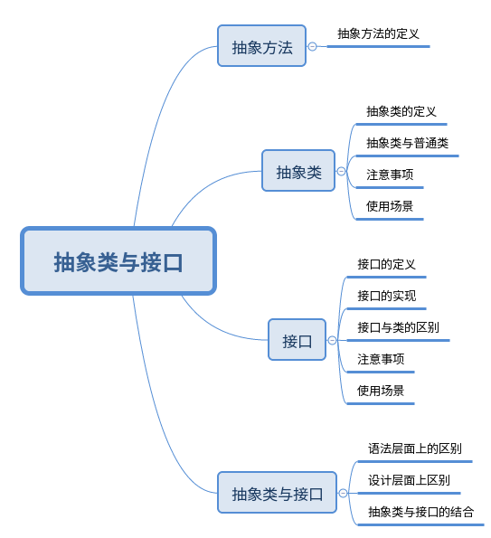
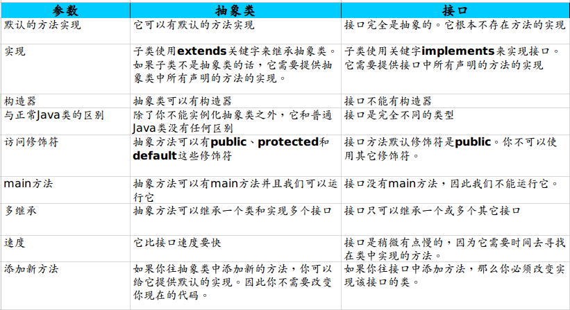

Java 抽象类&接口详解

--------

## 概述

     抽象类与接口是java语言中对抽象概念进行定义的两种机制，正是由于他们的存在才赋予java强大的面向对象的能力。他们两者之间对抽象概念的支持有很大的相似，甚至可以互换，但是也有区别。

本篇文章的注意内容如下：



## 抽象方法

    抽象方法是一种特殊的方法：它只有声明，而没有具体的实现。

定义格式如下：
```
abstract void fun();
```

抽象方法必须用abstract关键字进行修饰。

## 抽象类

    如果一个类含有抽象方法，则称这个类为抽象类，抽象类必须在类前用abstract关键字修饰。

    如果一个类不包含抽象方法，只是用abstract修饰的话也是抽象类。不过这样没有实际意义。
    
```
[public] abstract class ClassName {
    abstract void fun();
}
```

    从这里可以看出，抽象类就是为了继承而存在的，如果你定义了一个抽象类，却不去继承它，那么等于白白创建了这个抽象类，因为你不能用它来做任何事情。

    对于一个父类，如果它的某个方法在父类中实现出来没有任何意义，必须根据子类的实际需求来进行不同的实现，那么就可以将这个方法声明为abstract方法，此时这个类也就成为abstract类了。

    包含抽象方法的类称为抽象类，但并不意味着抽象类中只能有抽象方法，它和普通类一样，同样可以拥有成员变量和普通的成员方法。

### 抽象类 VS 普通类

1. 抽象方法必须为public或者protected（因为如果为private，则不能被子类继承，子类便无法实现该方法），缺省情况下默认为public。

2. 抽象类不能用来创建对象；

3. 如果一个类继承于一个抽象类，则子类必须实现父类的抽象方法。如果子类没有实现父类的抽象方法，则必须将子类也定义为为abstract类。

### 注意事项

1. 抽象类不能被实例化，实例化的工作应该交由它的子类来完成，它只需要有一个引用即可。

2. 抽象方法必须由子类来进行重写。

3. 只要包含一个抽象方法的抽象类，该类必须要定义成抽象类，不管是否还包含有其他方法。

4. 抽象类中可以包含具体的方法，当然也可以不包含抽象方法。

5. 子类中的抽象方法不能与父类的抽象方法同名。

6. abstract不能与final并列修饰同一个类。

7. abstract 不能与private、static、final或native并列修饰同一个方法。

## 接口

    接口，英文称作interface，在软件工程中，接口泛指供别人调用的方法或者函数。
    接口是对行为的抽象。
    接口是抽象方法的集合。
    如果一个类实现了某个接口，那么它就继承了这个接口的抽象方法。
    接口只是一种形式，接口自身不能做任何事情。

定一个接口的形式如下：
```
[public] interface InterfaceName {
 
}
```

### 实现接口

要让一个类遵循某组特地的接口需要使用implements关键字，具体格式如下：
```
class ClassName implements Interface1,Interface2,[....]{
}
```

可以看出，允许一个类遵循多个特定的接口。

通过接口，我们可以实现多重继承。

### 注意事项

1. 接口中可以含有变量和方法。但是接口中不存在实现的方法。

2. 接口中的变量会被隐式地指定为public static final变量,并且只能是public static final变量

3. 方法会被隐式地指定为public abstract方法且只能是public abstract方法,也就是说接口中的方法必须都是抽象方法

4. 如果一个非抽象类遵循了某个接口，就必须实现该接口中的所有方法。

5. 对于遵循某个接口的抽象类，可以不实现该接口中的抽象方法。

6.  不能使用new操作符实例化一个接口，但可以声明一个接口变量，该变量必须引用（refer to)一个实现该接口的类的对象。可以使用 instanceof 检查一个对象是否实现了某个特定的接口。例如：if(anObject instanceof Comparable){}。

7. 在实现多接口的时候一定要避免方法名的重复。


## 抽象类 VS 接口

### 语法层面上的区别

1. 抽象类可以提供成员方法的实现细节，而接口中只能存在public abstract 方法；

2. 抽象类中的成员变量可以是各种类型的，而接口中的成员变量只能是public static final类型的；

3. 接口中不能含有静态代码块以及静态方法（java8开始尝试支持），而抽象类可以有静态代码块和静态方法；

4. 一个类只能继承一个抽象类，而一个类却可以实现多个接口。

更多的参考下表：



### 设计层面上的区别

1. 抽象类是对一种事物的抽象，即对类抽象，而接口是对行为的抽象。
抽象类是对整个类整体进行抽象，包括属性、行为，但是接口却是对类局部（行为）进行抽象。

举个简单的例子，飞机和鸟是不同类的事物，但是它们都有一个共性，就是都会飞。那么在设计的时候，可以将飞机设计为一个类Airplane，将鸟设计为一个类Bird，但是不能将 飞行 这个特性也设计为类，因此它只是一个行为特性，并不是对一类事物的抽象描述。此时可以将 飞行 设计为一个接口Fly，包含方法fly( )，然后Airplane和Bird分别根据自己的需要实现Fly这个接口。然后至于有不同种类的飞机，比如战斗机、民用飞机等直接继承Airplane即可，对于鸟也是类似的，不同种类的鸟直接继承Bird类即可。
从这里可以看出，继承是一个 "是不是"的关系，而 接口 实现则是 "有没有"的关系。
如果一个类继承了某个抽象类，则子类必定是抽象类的种类，而接口实现则是有没有、具备不具备的关系，比如鸟是否能飞（或者是否具备飞行这个特点），能飞行则可以实现这个接口，不能飞行就不实现这个接口。

2. 设计层面不同，抽象类作为很多子类的父类，它是一种模板式设计。而接口是一种行为规范，它是一种辐射式设计。

对于抽象类而言，它是自下而上来设计的，我们要先知道子类才能抽象出父类，而接口则不同，它根本就不需要知道子类的存在，只需要定义一个规则即可，至于什么子类、什么时候怎么实现它一概不知。

举个简单的例子，大家都用过ppt里面的模板，如果用模板A设计了ppt B和ppt C，ppt B和ppt C公共的部分就是模板A了，如果它们的公共部分需要改动，则只需要改动模板A就可以了，不需要重新对ppt B和ppt C进行改动。而辐射式设计，比如某个电梯都装了某种报警器，一旦要更新报警器，就必须全部更新。也就是说对于抽象类，如果需要添加新的方法，可以直接在抽象类中添加具体的实现，子类可以不进行变更；而对于接口则不行，如果接口进行了变更，则所有实现这个接口的类都必须进行相应的改动。

3. 跨域不同,抽象类所跨域的是具有相似特点的类，而接口却可以跨域不同的类。

我们知道抽象类是从子类中发现公共部分，然后泛化成抽象类，子类继承该父类即可，但是接口不同。实现它的子类可以不存在任何关系，共同之处。

例如猫、狗可以抽象成一个动物类抽象类，具备叫的方法。鸟、飞机可以实现飞Fly接口，具备飞的行为，这里我们总不能将鸟、飞机共用一个父类吧！
所以说抽象类所体现的是一种继承关系，要想使得继承关系合理，父类和派生类之间必须存在"is-a" 关系，即父类和派生类在概念本质上应该是相同的。对于接口则不然，并不要求接口的实现者和接口定义在概念本质上是一致的， 仅仅是实现了接口定义的契约而已。

## 实例分析

门和警报的例子：门都有open( )和close( )两个动作，此时我们可以定义通过抽象类和接口来定义这个抽象概念：

```
abstract class Door {
    public abstract void open();
    public abstract void close();
}
```

```
interface Door {
    public abstract void open();
    public abstract void close();
}
```
但是现在如果我们需要门具有报警alarm( )的功能，那么该如何实现？下面提供两种思路：

　　1）将这三个功能都放在抽象类里面，但是这样一来所有继承于这个抽象类的子类都具备了报警功能，但是有的门并不一定具备报警功能；

　　2）将这三个功能都放在接口里面，需要用到报警功能的类就需要实现这个接口中的open( )和close( )，也许这个类根本就不具备open( )和close( )这两个功能，比如火灾报警器。

从这里可以看出， Door的open() 、close()和alarm()根本就属于两个不同范畴内的行为；
open()和close()属于门本身固有的行为特性，而alarm()属于延伸的附加行为。
因此最好的解决办法是单独将报警设计为一个接口，包含alarm()行为,Door设计为单独的一个抽象类，包含open和close两种行为。再设计一个报警门继承Door类和实现Alarm接口。

```
interface Alram {
    void alarm();
}
 
abstract class Door {
    void open();
    void close();
}
 
class AlarmDoor extends Door implements Alarm {
    void oepn() {
      //....
    }
    void close() {
      //....
    }
    void alarm() {
      //....
    }
}
```

## 使用场景

* 如果你拥有一些方法并且想让它们中的一些有默认实现，那么使用抽象类吧;

* 如果你想实现多重继承，那么你必须使用接口。由于Java不支持多继承，子类不能够继承多个类，但可以实现多个接口。因此你就可以使用接口来解决它;
    
* 如果基本功能在不断改变，那么就需要使用抽象类,如果不断改变基本功能并且使用接口，那么就需要改变所有实现了该接口的类。

## 总结

<b>合理的利用抽象类和接口可以实现完整意义上的多重继承</b>

1.  抽象类在java语言中所表示的是一种继承关系，一个子类只能存在一个父类，但是可以存在多个接口。

2. 在抽象类中可以拥有自己的成员变量和非抽象类方法，但是接口中只能存在静态的不可变的成员数据（不过一般都不在接口中定义成员数据），而且它的所有方法都是抽象的。

3. 抽象类和接口所反映的设计理念是不同的，抽象类所代表的是“is-a”的关系，而接口所代表的是“like-a”的关系。

抽象类和接口是java语言中两种不同的抽象概念，他们的存在对多态提供了非常好的支持，虽然他们之间存在很大的相似性。但是对于他们的选择往往反应了您对问题域的理解。只有对问题域的本质有良好的理解，才能做出正确、合理的设计。


## 参考文档

[深入理解Java的接口和抽象类](https://www.cnblogs.com/dolphin0520/p/3811437.html)

[Java抽象类与接口的区别](http://www.importnew.com/12399.html)

[](https://www.cnblogs.com/chenssy/p/3376708.html)