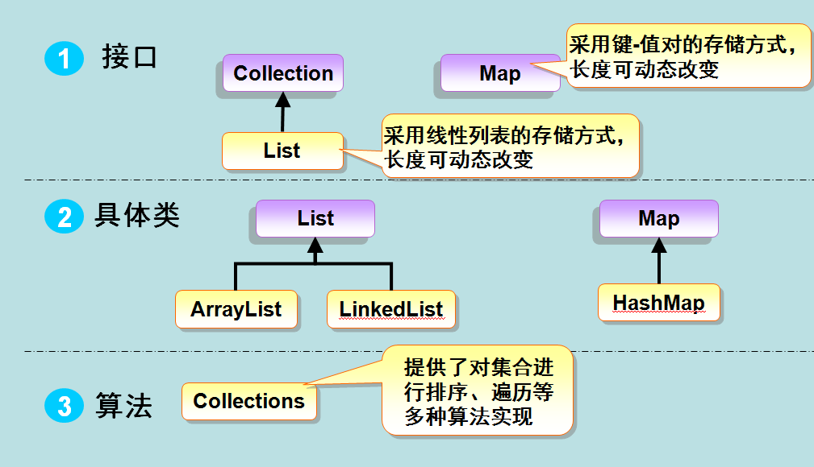

Java 集合详解

------

## 概述

早在 Java 2 中之前，Java 就提供了特设类。比如：Dictionary, Vector, Stack, 和 Properties 这些类用来存储和操作对象组。

虽然这些类都非常有用，但是它们缺少一个核心的，统一的主题。由于这个原因，使用 Vector 类的方式和使用 Properties 类的方式有着很大不同。

集合框架被设计成要满足以下几个目标。

    该框架必须是高性能的。基本集合（动态数组，链表，树，哈希表）的实现也必须是高效的。

    该框架允许不同类型的集合，以类似的方式工作，具有高度的互操作性。

    对一个集合的扩展和适应必须是简单的。

为此，整个集合框架就围绕一组标准接口而设计。你可以直接使用这些接口的标准实现，诸如： LinkedList, HashSet, 和 TreeSet 等,除此之外你也可以通过这些接口实现自己的集合。

 集合框架是一个用来代表和操纵集合的统一架构。所有的集合框架都包含如下内容：

    接口：是代表集合的抽象数据类型。例如 Collection、List、Set、Map 等。之所以定义多个接口，是为了以不同的方式操作集合对象

    实现（类）：是集合接口的具体实现。从本质上讲，它们是可重复使用的数据结构，例如：ArrayList、LinkedList、HashSet、HashMap。

    算法：是实现集合接口的对象里的方法执行的一些有用的计算，例如：搜索和排序。这些算法被称为多态，那是因为相同的方法可以在相似的接口上有着不同的实现。


从上面的集合框架图可以看到，Java 集合框架主要包括两种类型的容器，一种是集合（Collection），存储一个元素集合，另一种是图（Map），存储键/值对映射。Collection 接口又有 3 种子类型，List、Set 和 Queue，再下面是一些抽象类，最后是具体实现类，常用的有 ArrayList、LinkedList、HashSet、LinkedHashSet、HashMap、LinkedHashMap 等等。

集合框架体系如图所示：


Java 集合框架提供了一套性能优良，使用方便的接口和类，java集合框架位于java.util包中， 所以当使用集合框架的时候需要进行导包。

## 集合接口

### Collection

     Collection 是最基本的集合接口
     一个 Collection 代表一组 Object，即 Collection 的元素
     Java不提供直接继承自Collection的类，只提供继承于的子接口(如List和set)。

     Collection 接口存储一组不唯一，无序的对象。

    所有实现Collection接口的类都必须提供两个标准的构造函数：
        无参数的构造函数用于创建一个空的Collection
        有一个Collection参数的构造函数用于创建一个新的 Collection，这个新的Collection与传入的Collection有相同的元素。后一个构造函数允许用户复制一个Collection。

如何遍历Collection中的每一个元素？

    不论Collection的实际类型如何，它都支持一个iterator()的方法，该方法返回一个迭代子，使用该迭代子即可逐一访问Collection中每一个元素。典型的用法如下：

```
　　　　Iterator it = collection.iterator(); // 获得一个迭代器
　　　　while(it.hasNext()) {
　　　　　　Object obj = it.next(); // 得到下一个元素
　　　　}
```
    由Collection接口派生的两个接口是List和Set。

### List
     List接口是一个有序的 Collection
     使用此接口能够精确的控制每个元素插入的位置，能够通过索引(元素在List中位置，类似于数组的下标)来访问List中的元素，第一个元素的索引为 0。
     List允许有相同的元素。

     List 接口存储一组不唯一，有序（插入顺序）的对象。

    除了具有Collection接口必备的iterator()方法外，List还提供一个listIterator()方法，返回一个 ListIterator接口，和标准的Iterator接口相比，ListIterator多了一些add()之类的方法，允许添加，删除，设定元素，还能向前或向后遍历。

### Set
    Set 具有与 Collection 完全一样的接口，只是行为上不同，Set 不保存重复的元素。

    Set 接口存储一组唯一，无序的对象。

### SortedSet 
    继承于Set保存有序的集合。
    此接口主要用于排序操作，即实现此接口的子类都属于排序的子类

### Map
    Map 接口存储一组键值对象，提供key（键）到value（值）的映射。

    一个Map中不能包含相同的key，每个key只能映射一个 value。
    
    Map接口提供3种集合的视图，Map的内容可以被当作一组key集合，一组value集合，或者一组key-value映射。

    关于Map，我们要从代码复用的角度去理解，java是先实现了Map，然后通过包装了一个所有value都为null的Map就实现了Set集合

    Map的这些实现类和子接口中key集的存储形式和Set集合完全相同(即key不能重复)

    Map的这些实现类和子接口中value集的存储形式和List非常类似(即value可以重复、根据索引来查找)

### SortedMap
     继承于 Map，使 Key 保持在升序排列。

### Map.Entry 
     描述在一个Map中的一个元素（键/值对）。是一个Map的内部类。

### Enumeration

     这是一个传统的接口和定义的方法，通过它可以枚举（一次获得一个）对象集合中的元素。这个传统接口已被迭代器取代。

### Queue
    Queue用于模拟"队列"这种数据结构(先进先出 FIFO)。
    队列的头部保存着队列中存放时间最长的元素，队列的尾部保存着队列中存放时间最短的元素。新元素插入(offer)到队列的尾部，访问元素(poll)操作会返回队列头部的元素，队列不允许随机访问队列中的元素。
    
    结合生活中常见的排队就会很好理解这个概念

### Deque
    Deque接口代表一个"双端队列"，双端队列可以同时从两端来添加、删除元素，因此Deque的实现类既可以当成队列使用、也可以当成栈使用

## 集合实现类

### Collection

#### AbstractCollection

    实现了大部分的集合接口.

### List

#### AbstractList

     继承于AbstractCollection 并且实现了大部分List接口。

#### AbstractSequentialList

     继承于 AbstractList ，提供了对数据元素的链式访问而不是随机访问。

#### LinkedList

    该类实现了List接口，允许有null（空）元素。
    主要用于创建链表数据结构，该类没有同步方法，如果多个线程同时访问一个List，则必须自己实现访问同步，解决方法就是在创建List时候构造一个同步的List。

    能对它进行队列操作，即可以根据索引来随机访问集合中的元素。

    同时它还实现Deque接口，即能将LinkedList当作双端队列使用。自然也可以被当作"栈来使用"

```
Listlist=Collections.synchronizedList(newLinkedList(...));
```

    LinkedList 查找效率低。

#### ArrayList

    ArrayList是基于数组实现的List类，它封装了一个动态的增长的、允许再分配的Object[]数组。
    该类也是实现了List的接口，实现了可变大小的数组，随机访问和遍历元素时，提供更好的性能。
    该类也是非同步的,在多线程的情况下不要使用。
    ArrayList 增长当前长度的50%，插入删除效率低。 

每个ArrayList实例都有一个容量（Capacity），即用于存储元素的数组的大小。这个容量可随着不断添加新元素而自动增加，但是增长算法并没有定义。当需要插入大量元素时，在插入前可以调用ensureCapacity方法来增加ArrayList的容量以提高插入效率。

#### Vector 

    该类和ArrayList非常相似，但是该类是同步的，可以用在多线程的情况，该类允许设置默认的增长长度，默认扩容方式为原来的2倍。

    继承于AbstractList

    由Vector创建的Iterator，虽然和ArrayList创建的 Iterator是同一接口，但是，因为Vector是同步的，当一个Iterator被创建而且正在被使用，另一个线程改变了Vector的状态（例如，添加或删除了一些元素），这时调用Iterator的方法时将抛出ConcurrentModificationException，因此必须捕获该异常。

#### Stack 

     栈是Vector的一个子类，所以也属于List，它实现了一个标准的后进先出的栈。

     Stack提供5个额外的方法使得 Vector得以被当作堆栈使用。
     基本的push和pop方法，还有peek方法得到栈顶的元素，empty方法测试堆栈是否为空，search方法检测一个元素在堆栈中的位置。
     Stack刚创建后是空栈

### Set

#### AbstractSet

     继承于AbstractCollection 并且实现了大部分Set接口。

#### HashSet

     该类实现了Set接口，不允许出现重复元素，不保证集合中元素的顺序，允许包含值为null的元素，但最多只能一个。

     HashSet是Set接口的典型实现，HashSet使用HASH算法来存储集合中的元素，因此具有良好的存取和查找性能。
     当向HashSet集合中存入一个元素时，HashSet会调用该对象的hashCode()方法来得到该对象的hashCode值，然后根据该HashCode值决定该对象在HashSet中的存储位置。
        
     值得主要的是，HashSet集合判断两个元素相等的标准是两个对象通过equals()方法比较相等，并且两个对象的hashCode()方法的返回值相等

#### LinkedHashSet

     具有可预知迭代顺序的 Set 接口的哈希表和链接列表实现。

     LinkedHashSet集合也是根据元素的hashCode值来决定元素的存储位置，但和HashSet不同的是，它同时使用链表维护元素的次序，这样使得元素看起来是以插入的顺序保存的。当遍历LinkedHashSet集合里的元素时，LinkedHashSet将会按元素的添加顺序来访问集合里的元素。
            
     LinkedHashSet需要维护元素的插入顺序，因此性能略低于HashSet的性能，但在迭代访问Set里的全部元素时(遍历)将有很好的性能(链表很适合进行遍历)

#### TreeSet

    该类实现了Set接口，可以实现排序等功能。

    与HashSet集合采用hash算法来决定元素的存储位置不同，TreeSet采用红黑树的数据结构来存储集合元素。TreeSet支持两种排序方式: 自然排序、定制排序.

1. 自然排序:

TreeSet会调用集合元素的compareTo(Object obj)方法来比较元素之间的大小关系，然后将集合元素按升序排序，即自然排序。如果试图把一个对象添加到TreeSet时，则该对象的类必须实现Comparable接口，否则程序会抛出异常。

当把一个对象加入TreeSet集合中时，TreeSet会调用该对象的compareTo(Object obj)方法与容器中的其他对象比较大小，然后根据红黑树结构找到它的存储位置。如果两个对象通过compareTo(Object obj)方法比较相等，新对象将无法添加到TreeSet集合中(牢记Set是不允许重复的概念)。

注意: 当需要把一个对象放入TreeSet中，重写该对象对应类的equals()方法时，应该保证该方法与compareTo(Object obj)方法有一致的结果，即如果两个对象通过equals()方法比较返回true时，这两个对象通过compareTo(Object obj)方法比较结果应该也为0(即相等)

看到这里，我们应该明白：

    1) 对与Set来说，它定义了equals()为唯一性判断的标准，而对于到了具体的实现，HashSet、TreeSet来说，它们又会有自己特有的唯一性判断标准，只有同时满足了才能判定为唯一性
    2) 我们在操作这些集合类的时候，对和唯一性判断有关的函数重写要重点关注

2. 定制排序

TreeSet的自然排序是根据集合元素的大小，TreeSet将它们以升序排序。如果我们需要实现定制排序，则可以通过Comparator接口的帮助(类似PHP中的array_map回调处理函数的思想)。该接口里包含一个int compare(T o1， T o2)方法，该方法用于比较大小


    1) equals、compareTo决定的是怎么比的问题，即用什么field进行大小比较
    2) 自然排序、定制排序、Comparator决定的是谁大的问题，即按什么顺序(升序、降序)进行排序
    它们的关注点是不同的，一定要注意区分

#### EnumSet

     EnumSet是一个专门为枚举类设计的集合类，EnumSet中所有元素都必须是指定枚举类型的枚举值，该枚举类型在创建EnumSet时显式、或隐式地指定。EnumSet的集合元素也是有序的，它们以枚举值在Enum类内的定义顺序来决定集合元素的顺序

### Map

#### AbstractMap

     实现了大部分的Map接口。

#### HashMap 

    HashMap 是一个散列表，它存储的内容是键值对(key-value)映射。

    和HashSet集合不能保证元素的顺序一样，HashMap也不能保证key-value对的顺序。
    
    该类实现了Map接口，根据键的HashCode值存储数据，具有很快的访问速度，最多允许一条记录的键为null，不支持线程同步。

    HashMap和Hashtable类似，不同之处在于HashMap是非同步的，并且允许null，即null value和null key。

    HashMap视为Collection时（values()方法可返回Collection），其迭代子操作时间开销和HashMap的容量成比例。因此，如果迭代操作的性能相当重要的话，不要将HashMap的初始化容量设得过高，或者load factor过低。


#### LinkedHashMap 

     继承于HashMap，使用元素的自然顺序对元素进行排序.

     LinkedHashMap也使用双向链表来维护key-value对的次序，该链表负责维护Map的迭代顺序，与key-value对的插入顺序一致(注意和TreeMap对所有的key-value进行排序进行区分)

#### TreeMap 

     继承了AbstractMap，并且使用一颗树。

#### WeakHashMap 

     继承AbstractMap类，使用弱密钥的哈希表。

     WeakHashMap是一种改进的HashMap，它对key实行“弱引用”，如果一个key不再被外部所引用，那么该key可以被GC回收。


#### IdentityHashMap 

     继承AbstractMap类，比较文档时使用引用相等。

     IdentityHashMap的实现机制与HashMap基本相似，在IdentityHashMap中，当且仅当两个key严格相等(key1 == key2)时，IdentityHashMap才认为两个key相等

#### EnumMap

     EnumMap是一个与枚举类一起使用的Map实现，EnumMap中的所有key都必须是单个枚举类的枚举值。创建EnumMap时必须显式或隐式指定它对应的枚举类。
     EnumMap根据key的自然顺序(即枚举值在枚举类中的定义顺序)

### Queue

#### PriorityQueue

    PriorityQueue并不是一个比较标准的队列实现，PriorityQueue保存队列元素的顺序并不是按照加入队列的顺序，而是按照队列元素的大小进行重新排序，这点从它的类名也可以看出来

### Deque

#### ArrayDeque

    是一个基于数组的双端队列，和ArrayList类似，它们的底层都采用一个动态的、可重分配的Object[]数组来存储集合元素，当集合元素超出该数组的容量时，系统会在底层重新分配一个Object[]数组来存储集合元素

### Dictionary 

     Dictionary 类是一个抽象类，用来存储键/值对，作用和Map类相似。

#### Hashtable 

     Hashtable 是 Dictionary(字典) 类的子类，位于 java.util 包中。
     任何非空（non-null）的对象都可作为key或者value。

     添加数据使用put(key, value)，取出数据使用get(key)，这两个基本操作的时间开销为常数。

     Hashtable 通过initial capacity和load factor两个参数调整性能。通常缺省的load factor 0.75较好地实现了时间和空间的均衡。增大load factor可以节省空间但相应的查找时间将增大，这会影响像get和put这样的操作。

     由于作为key的对象将通过计算其散列函数来确定与之对应的value的位置，因此任何作为key的对象都必须实现hashCode和equals方法。hashCode和equals方法继承自根类Object，如果你用自定义的类当作key的话，要相当小心，按照散列函数的定义，如果两个对象相同，即obj1.equals(obj2)=true，则它们的hashCode必须相同，但如果两个对象不同，则它们的hashCode不一定不同，如果两个不同对象的hashCode相同，这种现象称为冲突，冲突会导致操作哈希表的时间开销增大，所以尽量定义好的hashCode()方法，能加快哈希表的操作。
     
     Hashtable是同步的。
#### Properties 

     Properties 继承于 Hashtable，表示一个持久的属性集，属性列表中每个键及其对应值都是一个字符串。

     Properties对象在处理属性文件时特别方便(windows平台上的.ini文件)，Properties类可以把Map对象和属性文件关联起来，从而可以把Map对象中的key-value对写入到属性文件中，也可以把属性文件中的"属性名-属性值"加载到Map对象中

### BitSet

     一个Bitset类创建一种特殊类型的数组来保存位值。BitSet中数组大小会随需要增加。

## 集合差异对比

### ArrayList 和 LinkedList 的区别

    ArrayList 是 List 接口的一种实现，它是使用数组来实现的。

    LinkedList 是 List 接口的一种实现，它是使用链表来实现的。

    ArrayList 遍历和查找元素比较快。LinkedList 遍历和查找元素比较慢。

    ArrayList 添加、删除元素比较慢。LinkedList 添加、删除元素比较快。

### map.entrySet() 和 keySet()

1、如果遍历 hashMap() 时 entrySet() 方法是将 key 和 value 全部取出来,所以性能开销是可以预计的, 而 keySet() 方法进行遍历的时候是根据取出的 key 值去查询对应的 value 值, 所以如果 key 值是比较简单的结构(如 1,2,3...)的话性能消耗上是比 entrySet() 方法低, 但随着 key 值得复杂度提高 entrySet() 的优势就会显露出来。

2、综合比较在只遍历 key 的时候使用 keySet(), 在只遍历 value 的是使用 values() 方法, 在遍历 key-value 的时候使用 entrySet() 是比较合理的选择。

3、如果遍历 TreeMap 的时候, 不同于 HashMap 在遍历 ThreeMap 的 key-value 时候务必使用 entrySet() 它要远远高于其他两个的性能, 同样只遍历 key 的时候使用 keySet(), 在只遍历 value 的是使用 values() 方法对于 TreeMap 也同样适用。

### Set和List的区别

    1. Set 接口实例存储的是无序的，不重复的数据。List 接口实例存储的是有序的，可以重复的元素。

    2. Set检索效率低下，删除和插入效率高，插入和删除不会引起元素位置改变 <实现类有HashSet,TreeSet>。

    3. List和数组类似，可以动态增长，根据实际存储的数据的长度自动增长List的长度。查找元素效率高，插入删除效率低，因为会引起其他元素位置改变 <实现类有ArrayList,LinkedList,Vector> 。

### Map VS List

* List，可以通过get()方法来一次取出一个元素。使用数字来选择一堆对象中的一个
    get(0)
    (add/get)

一般使用ArrayList。用LinkedList构造堆栈stack、队列queue。

* Map用 put(k,v) / get(k)，还可以使用containsKey()/containsValue()来检查其中是否含有某个key/value。HashMap会利用对象的hashCode来快速找到key。
* Map中元素，可以将key序列、value序列单独抽取出来。
使用keySet()抽取key序列，将map中的所有keys生成一个Set。
使用values()抽取value序列，将map中的所有values生成一个Collection。

###　Collection　VS Map

Collection和Map的区别在于容器中每个位置保存的元素个数:


1) Collection 每个位置只能保存一个元素(对象)
2) Map保存的是"键值对"，就像一个小型数据库。我们可以通过"键"找到该键对应的"值"

### Vector & ArrayList

* 同步性

Vector 是同步的。这个类中的一些方法保证了Vector中的对象是线程安全的。而ArrayList则是异步的，因此ArrayList中的对象并不是线程安全的。因为同步的要求会影响执行的效率，所以如果你不需要线程安全的集合那么使用ArrayList是一个很好的选择，这样可以避免由于同步带来的不必要的性能开销。

* 数据增长

从内部实现机制来讲ArrayList和Vector都是使用数组(Array)来控制集合中的对象。当你向这两种类型中增加元素的时候，如果元素的数目超出了内部数组目前的长度它们都需要扩展内部数组的长度.
Vector缺省情况下自动增长原来一倍的数组长度， 
ArrayList是原来的50%,
最后你获得的这个集合所占的空间总是比你实际需要的要大。

所以如果你要在集合中保存大量的数据那么使用 Vector有一些优势，因为你可以通过设置集合的初始化大小来避免不必要的资源开销。

* 使用模式

在ArrayList和Vector中，从一个指定的位置（通过索引）查找数据或是在集合的末尾增加、移除一个元素所花费的时间是一样的，这个时间我们用O(1)表示。但是，如果在集合的其他位置增加或移除元素那么花费的时间会呈线形增长：O(n-i)，其中n代表集合中元素的个数，i代表元素增加或移除元素的索引位置。为什么会这样呢？以为在进行上述操作的时候集合中第i和第i个元素之后的所有元素都要执行位移的操作。这一切意味着什么呢？

这意味着，你只是查找特定位置的元素或只在集合的末端增加、移除元素，那么使用Vector或ArrayList都可以。如果是其他操作，你最好选择其他的集合操作类。比如，LinkList集合类在增加或移除集合中任何位置的元素所花费的时间都是一样的?O(1)，但它在索引一个元素的使用缺比较慢－O(i),其中i是索引的位置.使用 ArrayList也很容易，因为你可以简单的使用索引来代替创建iterator对象的操作。LinkList也会为每个插入的元素创建对象，所有你要明白它也会带来额外的开销。

* 使用数组

建议使用一个简单的数组（Array）来代替Vector或ArrayList。尤其是对于执行效率要求高的程序更应如此。因为使用数组(Array)避免了同步、额外的方法调用和不必要的重新分配空间的操作。

## 集合转换

### List-->Set 

```
Set<String> listSet = new HashSet<String>(list);  
```

### Set --> List

```
List<String> setList = new ArrayList<String>(set); 
```

### List-->数组

```
List<String> list = new ArrayList<String>();
Object[] objects = list.toArray();
```

### 数组-->List 

```
String[] ss = {"JJ","KK"};    
List<String> list1 = Arrays.asList(ss);    
List<String> list2 = Arrays.asList("AAA","BBB");
```

### List -> Map

    从定义就知道这是不存在的。

### Map -> List
    Ｍap不能直接转List，只能将将其键值分别转换为List

#### 将Map Key 转化为List  

```
List<String> mapKeyList = new ArrayList<String>(map.keySet()); 
```

#### 将Map Value 转化为List  

```
List<String> mapValuesList = new ArrayList<String>(map.values()); 
```
### Map -> Set

#### 将Map 的键转化为Set

```
Set<String> mapKeySet = map.keySet(); 
```

#### 将Map 的值转化为Set 

```
Set<String> mapValuesSet = new HashSet<String>(map.values());
```

### 数组 -> Set

```
Set<String> set = new HashSet<String>(Arrays.asList(arr)); 
```

###　Set-->数组

```
String[] arr = new String[set.size()];    
set.toArray(arr);
```

## 集合 & 泛型 集合中的集合

    Java的集合都支持泛型，可以实现集合中的集合，例如：

    List<Map> 

TODO

## 集合算法

     集合框架定义了几种算法，可用于集合和映射。这些算法被定义为集合类的静态方法。

    在尝试比较不兼容的类型时，一些方法能够抛出 ClassCastException异常。当试图修改一个不可修改的集合时，抛出UnsupportedOperationException异常。

    集合定义三个静态的变量：EMPTY_SET，EMPTY_LIST，EMPTY_MAP的。这些变量都不可改变。

## 迭代器

     迭代器，使你能够通过循环来得到或删除集合的元素。ListIterator 继承了Iterator，以允许双向遍历列表和修改元素。

    是一个对象，实现了Iterator 接口或ListIterator接口。

### Iterator

    迭代器对象

### Iterable

    迭代器接口，这是Collection类的父接口。实现这个Iterable接口的对象允许使用foreach进行遍历，也就是说，所有的Collection集合对象都具有"foreach可遍历性"。这个Iterable接口只

    有一个方法: iterator()。它返回一个代表当前集合对象的泛型<T>迭代器，用于之后的遍历操作

    Collection接口继承了Iterable接口，也就是说，我们以上学习到的所有的Collection集合类都具有"可遍历性"

    Iterable接口也是java集合框架的成员，它隐藏了各种Collection实现类的底层细节，向应用程序提供了遍历Collection集合元素的统一编程接口:

        1) boolean hasNext(): 是否还有下一个未遍历过的元素
        2) Object next(): 返回集合里的下一个元素
        3) void remove(): 删除集合里上一次next方法返回的元素

#### 实例

iterator必须依附于Collection对象，若有一个iterator对象，必然有一个与之关联的Collection对象。

iterator实现遍历:
```
import java.util.*;

public class IteratorTest
{
    public static void main(String[] args) 
    {
        //创建一个集合
        Collection books = new HashSet();
        books.add("轻量级Java EE企业应用实战");
        books.add("疯狂Java讲义");
        books.add("疯狂Android讲义");


        //获取books集合对应的迭代器
        Iterator it = books.iterator();
        while(it.hasNext())
        {
            //it.next()方法返回的数据类型是Object类型，
            //需要强制类型转换
            String book = (String)it.next();
            System.out.println(book);
            if (book.equals("疯狂Java讲义"))
            {
                //从集合中删除上一次next方法返回的元素
                it.remove();
            }
            //对book变量赋值，不会改变集合元素本身
            book = "测试字符串";    
        }
        System.out.println(books);
    }
}
```
除了可以使用iterator接口迭代访问Collection集合里的元素之外，使用java5提供的foreach循环迭代访问集合元素更加便捷

foreach实现遍历:
```
import java.util.*;

public class ForeachTest
{
    public static void main(String[] args) 
    {
        //创建一个集合
        Collection books = new HashSet();
        books.add(new String("轻量级Java EE企业应用实战"));
        books.add(new String("疯狂Java讲义"));
        books.add(new String("疯狂Android讲义"));

        for (Object obj : books)
        {
            //此处的book变量也不是集合元素本身
            String book = (String)obj;
            System.out.println(book);
            if (book.equals("疯狂Android讲义"))
            {
                //下面代码会引发ConcurrentModificationException异常
                //books.remove(book);      
            }
        }
        System.out.println(books);
    }
}
```

###　ListIterator

    除了Collection固有的iterator()方法，List还额外提供了一个listIterator()方法，该方法返回一个ListIterator对象。
    ListIterator接口继承了Iterator接口，提供了专门操作List的方法。ListIterator接口在Iterator接口的继承上增加了如下方法:

        1) boolean hasPrevious(): 返回该迭代器关联的集合是否还有上一个元素
        2) Object previous(): 返回该迭代器的上一个元素(向前迭代)
        3) void add(): 在指定位置插入一个元素

#### 实例

ListIterator实现遍历:

```
import java.util.*;

public class ListIteratorTest
{
    public static void main(String[] args) 
    {
        String[] books = {
            "疯狂Java讲义",
            "轻量级Java EE企业应用实战"
        };
        List bookList = new ArrayList();
        for (int i = 0; i < books.length ; i++ )
        {
            bookList.add(books[i]);
        }
        ListIterator lit = bookList.listIterator();
        while (lit.hasNext())
        {
            System.out.println(lit.next());
            lit.add("-------分隔符-------");
        }
        System.out.println("=======下面开始反向迭代=======");
        while(lit.hasPrevious())
        {
            System.out.println(lit.previous());
        }
    }
}
```


### 遍历 ArrayList
 三种方法都是用来遍历ArrayList集合，第三种方法是采用迭代器的方法，该方法可以不用担心在遍历的过程中会超出集合的长度。 

```
import java.util.*;
 
public class Test{
 public static void main(String[] args) {
     List<String> list=new ArrayList<String>();
     list.add("Hello");
     list.add("World");
     list.add("HAHAHAHA");
     //第一种遍历方法使用foreach遍历List
     for (String str : list) {            //也可以改写for(int i=0;i<list.size();i++)这种形式
        System.out.println(str);
     }
 
     //第二种遍历，把链表变为数组相关的内容进行遍历
     String[] strArray=new String[list.size()];
     list.toArray(strArray);
     for(int i=0;i<strArray.length;i++) //这里也可以改写为  foreach(String str:strArray)这种形式
     {
        System.out.println(strArray[i]);
     }
     
    //第三种遍历 使用迭代器进行相关遍历
     
     Iterator<String> ite=list.iterator();
     while(ite.hasNext())//判断下一个元素之后有值
     {
         System.out.println(ite.next());
     }
 }
}

```

### 遍历 Map

```

import java.util.*;
 
public class Test{
     public static void main(String[] args) {
      Map<String, String> map = new HashMap<String, String>();
      map.put("1", "value1");
      map.put("2", "value2");
      map.put("3", "value3");
      
      //第一种：普遍使用，二次取值
      System.out.println("通过Map.keySet遍历key和value：");
      for (String key : map.keySet()) {
       System.out.println("key= "+ key + " and value= " + map.get(key));
      }
      
      //第二种
      System.out.println("通过Map.entrySet使用iterator遍历key和value：");
      Iterator<Map.Entry<String, String>> it = map.entrySet().iterator();
      while (it.hasNext()) {
       Map.Entry<String, String> entry = it.next();
       System.out.println("key= " + entry.getKey() + " and value= " + entry.getValue());
      }
      
      //第三种：推荐，尤其是容量大时
      System.out.println("通过Map.entrySet遍历key和value");
      for (Map.Entry<String, String> entry : map.entrySet()) {
       System.out.println("key= " + entry.getKey() + " and value= " + entry.getValue());
      }
    
      //第四种
      System.out.println("通过Map.values()遍历所有的value，但不能遍历key");
      for (String v : map.values()) {
       System.out.println("value= " + v);
      }
     }
}

```

## 比较器 

     TreeSet和TreeMap的按照排序顺序来存储元素. 然而，这是通过比较器来精确定义按照什么样的排序顺序。

### Comparator
    
    我们可以实现自己的比较方法，来控制排序规则

## 实例场景

### Set

#### HashSet

```
import java.util.*; 

//类A的equals方法总是返回true,但没有重写其hashCode()方法。不能保证当前对象是HashSet中的唯一对象
class A
{
    public boolean equals(Object obj)
    {
        return true;
    }
}

//类B的hashCode()方法总是返回1,但没有重写其equals()方法。不能保证当前对象是HashSet中的唯一对象
class B
{
    public int hashCode()
    {
        return 1;
    }
}

//类C的hashCode()方法总是返回2,且有重写其equals()方法
class C
{
    public int hashCode()
    {
        return 2;
    }
    public boolean equals(Object obj)
    {
        return true;
    }
}
public class HashSetTest
{
    public static void main(String[] args) 
    {
        HashSet books = new HashSet();
        //分别向books集合中添加两个A对象，两个B对象，两个C对象
        books.add(new A());
        books.add(new A());

        books.add(new B());
        books.add(new B());

        books.add(new C());
        books.add(new C());
        System.out.println(books);
    }
}
```

可以看到，如果两个对象通过equals()方法比较返回true，但这两个对象的hashCode()方法返回不同的hashCode值时，这将导致HashSet会把这两个对象保存在Hash表的不同位置，从而使对象可以添加成功，这就与Set集合的规则有些出入了。
所以，我们要明确的是: equals()决定是否可以加入HashSet、而hashCode()决定存放的位置，它们两者必须同时满足才能允许一个新元素加入HashSet

但是要注意的是: 如果两个对象的hashCode相同，但是它们的equlas返回值不同，HashSet会在这个位置用链式结构来保存多个对象。而HashSet访问集合元素时也是根据元素的HashCode值来快速定位的，这种链式结构会导致性能下降。

所以如果需要把某个类的对象保存到HashSet集合中，我们在重写这个类的equlas()方法和hashCode()方法时，应该尽量保证两个对象通过equals()方法比较返回true时，它们的hashCode()方法返回值也相等

#### LinkedHashSet

```
import java.util.*; 

public class LinkedHashSetTest
{
    public static void main(String[] args) 
    {
        LinkedHashSet books = new LinkedHashSet();
        books.add("Java");
        books.add("LittleHann");
        System.out.println(books);

        //删除 Java
      books.remove("Java");
        //重新添加 Java
        books.add("Java");
        System.out.println(books);
    }
}
```
元素的顺序总是与添加顺序一致，同时要明白的是，LinkedHashSetTest是HashSet的子类，因此它不允许集合元素重复

#### TreeSet 
```
import java.util.*;

public class TreeSetTest
{
    public static void main(String[] args) 
    {
        TreeSet nums = new TreeSet();
        //向TreeSet中添加四个Integer对象
        nums.add(5);
        nums.add(2);
        nums.add(10);
        nums.add(-9);

        //输出集合元素，看到集合元素已经处于排序状态
        System.out.println(nums);

        //输出集合里的第一个元素
        System.out.println(nums.first());

        //输出集合里的最后一个元素
        System.out.println(nums.last());

        //返回小于4的子集，不包含4
        System.out.println(nums.headSet(4));

        //返回大于5的子集，如果Set中包含5，子集中还包含5
        System.out.println(nums.tailSet(5));

        //返回大于等于-3，小于4的子集。
        System.out.println(nums.subSet(-3 , 4));
    }
}
```

#### EnumSet

```
import java.util.*;

enum Season
{
    SPRING,SUMMER,FALL,WINTER
}
public class EnumSetTest
{
    public static void main(String[] args) 
    {
        //创建一个EnumSet集合，集合元素就是Season枚举类的全部枚举值
        EnumSet es1 = EnumSet.allOf(Season.class);
        //输出[SPRING,SUMMER,FALL,WINTER]
        System.out.println(es1);

        //创建一个EnumSet空集合，指定其集合元素是Season类的枚举值。
        EnumSet es2 = EnumSet.noneOf(Season.class); 
        //输出[]
        System.out.println(es2); 
        //手动添加两个元素
        es2.add(Season.WINTER);
        es2.add(Season.SPRING);
        //输出[SPRING,WINTER]
        System.out.println(es2);

        //以指定枚举值创建EnumSet集合
        EnumSet es3 = EnumSet.of(Season.SUMMER , Season.WINTER); 
        //输出[SUMMER,WINTER]
        System.out.println(es3);

        EnumSet es4 = EnumSet.range(Season.SUMMER , Season.WINTER); 
        //输出[SUMMER,FALL,WINTER]
        System.out.println(es4);

        //新创建的EnumSet集合的元素和es4集合的元素有相同类型，
        //es5的集合元素 + es4集合元素 = Season枚举类的全部枚举值
        EnumSet es5 = EnumSet.complementOf(es4); 
        //输出[SPRING]
        System.out.println(es5);
    }
}
```

### List

#### ArrayList

如果一开始就知道ArrayList集合需要保存多少元素，则可以在创建它们时就指定initialCapacity大小，这样可以减少重新分配的次数，提供性能，ArrayList还提供了如下方法来重新分配Object[]数组

```
1) ensureCapacity(int minCapacity): 将ArrayList集合的Object[]数组长度增加minCapacity
2) trimToSize(): 调整ArrayList集合的Object[]数组长度为当前元素的个数。程序可以通过此方法来减少ArrayList集合对象占用的内存空间
```

```
import java.util.*;

public class ListTest
{
    public static void main(String[] args) 
    {
        List books = new ArrayList();
        //向books集合中添加三个元素
        books.add(new String("轻量级Java EE企业应用实战"));
        books.add(new String("疯狂Java讲义"));
        books.add(new String("疯狂Android讲义"));
        System.out.println(books);

        //将新字符串对象插入在第二个位置
        books.add(1 , new String("疯狂Ajax讲义"));
        for (int i = 0 ; i < books.size() ; i++ )
        {
            System.out.println(books.get(i));
        }

        //删除第三个元素
        books.remove(2);
        System.out.println(books);

        //判断指定元素在List集合中位置：输出1，表明位于第二位
        System.out.println(books.indexOf(new String("疯狂Ajax讲义")));  //①
        //将第二个元素替换成新的字符串对象
        books.set(1, new String("LittleHann"));
        System.out.println(books);

        //将books集合的第二个元素（包括）
        //到第三个元素（不包括）截取成子集合
        System.out.println(books.subList(1 , 2));
    }
```

#### LinkedList

LinkedList同时表现出了双端队列、栈的用法。功能非常强大

```
import java.util.*;

public class LinkedListTest
{
    public static void main(String[] args) 
    {
        LinkedList books = new LinkedList();

        //将字符串元素加入队列的尾部(双端队列)
        books.offer("疯狂Java讲义");

        //将一个字符串元素加入栈的顶部(双端队列)
        books.push("轻量级Java EE企业应用实战");

        //将字符串元素添加到队列的头(相当于栈的顶部)
        books.offerFirst("疯狂Android讲义");

        for (int i = 0; i < books.size() ; i++ )
        {
            System.out.println(books.get(i));
        }

        //访问、并不删除栈顶的元素
        System.out.println(books.peekFirst());
        //访问、并不删除队列的最后一个元素
        System.out.println(books.peekLast());
        //将栈顶的元素弹出"栈"
        System.out.println(books.pop());
        //下面输出将看到队列中第一个元素被删除
        System.out.println(books);
        //访问、并删除队列的最后一个元素
        System.out.println(books.pollLast());
        //下面输出将看到队列中只剩下中间一个元素：
        //轻量级Java EE企业应用实战
        System.out.println(books);
    }
}
```

#### Stack

注意Stack的后进先出的特点
```
import java.util.*;

public class VectorTest
{
    public static void main(String[] args) 
    {
        Stack v = new Stack();
        //依次将三个元素push入"栈"
        v.push("疯狂Java讲义");
        v.push("轻量级Java EE企业应用实战");
        v.push("疯狂Android讲义");

        //输出：[疯狂Java讲义, 轻量级Java EE企业应用实战 , 疯狂Android讲义]
        System.out.println(v);

        //访问第一个元素，但并不将其pop出"栈"，输出：疯狂Android讲义
        System.out.println(v.peek());

        //依然输出：[疯狂Java讲义, 轻量级Java EE企业应用实战 , 疯狂Android讲义]
        System.out.println(v);

        //pop出第一个元素，输出：疯狂Android讲义
        System.out.println(v.pop());

        //输出：[疯狂Java讲义, 轻量级Java EE企业应用实战]
        System.out.println(v);
    }
}
```

### Queue

#### PriorityQueue

```
import java.util.*;

public class PriorityQueueTest
{
    public static void main(String[] args) 
    {
        PriorityQueue pq = new PriorityQueue();
        //下面代码依次向pq中加入四个元素
        pq.offer(6);
        pq.offer(-3);
        pq.offer(9);
        pq.offer(0);

        //输出pq队列，并不是按元素的加入顺序排列，
        //而是按元素的大小顺序排列，输出[-3, 0, 9, 6]
        System.out.println(pq);
        //访问队列第一个元素，其实就是队列中最小的元素：-3
        System.out.println(pq.poll());
    }
}
```

PriorityQueue不允许插入null元素，它还需要对队列元素进行排序，PriorityQueue的元素有两种排序方式

    1) 自然排序:
    采用自然顺序的PriorityQueue集合中的元素对象都必须实现了Comparable接口，而且应该是同一个类的多个实例，否则可能导致ClassCastException异常
    2) 定制排序
    创建PriorityQueue队列时，传入一个Comparator对象，该对象负责对队列中的所有元素进行排序
关于自然排序、定制排序的原理和之前说的TreeSet类似

#### ArrayDeque

```
import java.util.*;

public class ArrayDequeTest
{
    public static void main(String[] args) 
    {
        ArrayDeque stack = new ArrayDeque();
        //依次将三个元素push入"栈"
        stack.push("疯狂Java讲义");
        stack.push("轻量级Java EE企业应用实战");
        stack.push("疯狂Android讲义");

        //输出：[疯狂Java讲义, 轻量级Java EE企业应用实战 , 疯狂Android讲义]
        System.out.println(stack);

        //访问第一个元素，但并不将其pop出"栈"，输出：疯狂Android讲义
        System.out.println(stack.peek());

        //依然输出：[疯狂Java讲义, 轻量级Java EE企业应用实战 , 疯狂Android讲义]
        System.out.println(stack);

        //pop出第一个元素，输出：疯狂Android讲义
        System.out.println(stack.pop());

        //输出：[疯狂Java讲义, 轻量级Java EE企业应用实战]
        System.out.println(stack);
    }
}
```

### Map

#### HashMap && Hashtable

```
import java.util.*;

class A
{
    int count;
    public A(int count)
    {
        this.count = count;
    }
    //根据count的值来判断两个对象是否相等。
    public boolean equals(Object obj)
    {
        if (obj == this)
            return true;
        if (obj!=null &&
            obj.getClass()==A.class)
        {
            A a = (A)obj;
            return this.count == a.count;
        }
        return false;
    }
    //根据count来计算hashCode值。
    public int hashCode()
    {
        return this.count;
    }
}
class B
{
    //重写equals()方法，B对象与任何对象通过equals()方法比较都相等
    public boolean equals(Object obj)
    {
        return true;
    }
}
public class HashtableTest
{
    public static void main(String[] args) 
    {
        Hashtable ht = new Hashtable();
        ht.put(new A(60000) , "疯狂Java讲义");
        ht.put(new A(87563) , "轻量级Java EE企业应用实战");
        ht.put(new A(1232) , new B());
        System.out.println(ht);

        //只要两个对象通过equals比较返回true，
        //Hashtable就认为它们是相等的value。
        //由于Hashtable中有一个B对象，
        //它与任何对象通过equals比较都相等，所以下面输出true。
        System.out.println(ht.containsValue("测试字符串"));  //①

        //只要两个A对象的count相等，它们通过equals比较返回true，且hashCode相等
        //Hashtable即认为它们是相同的key，所以下面输出true。
        System.out.println(ht.containsKey(new A(87563)));   //②

        //下面语句可以删除最后一个key-value对
        ht.remove(new A(1232));    //③

        //通过返回Hashtable的所有key组成的Set集合，
        //从而遍历Hashtable每个key-value对
        for (Object key : ht.keySet())
        {
            System.out.print(key + "---->");
            System.out.print(ht.get(key) + "\n");
        }
    }
}
```
当使用自定义类作为HashMap、Hashtable的key时，如果重写该类的equals(Object obj)和hashCode()方法，则应该保证两个方法的判断标准一致--当两个key通过equals()方法比较返回true时，两个key的hashCode()的返回值也应该相同

#### LinkedHashMap

```
import java.util.*;

public class LinkedHashMapTest
{
    public static void main(String[] args) 
    {
        LinkedHashMap scores = new LinkedHashMap();
        scores.put("语文" , 80);
        scores.put("英文" , 82);
        scores.put("数学" , 76);
        //遍历scores里的所有的key-value对
        for (Object key : scores.keySet())
        {
            System.out.println(key + "------>" + scores.get(key));
        }
    }
}
```

#### TreeMap

```
import java.util.*;

class R implements Comparable
{
    int count;
    public R(int count)
    {
        this.count = count;
    }
    public String toString()
    {
        return "R[count:" + count + "]";
    }
    //根据count来判断两个对象是否相等。
    public boolean equals(Object obj)
    {
        if (this == obj)
            return true;
        if (obj!=null
            && obj.getClass()==R.class)
        {
            R r = (R)obj;
            return r.count == this.count;
        }
        return false;
    }
    //根据count属性值来判断两个对象的大小。
    public int compareTo(Object obj)
    {
        R r = (R)obj;
        return count > r.count ? 1 :
            count < r.count ? -1 : 0;
    }
}
public class TreeMapTest
{
    public static void main(String[] args) 
    {
        TreeMap tm = new TreeMap();
        tm.put(new R(3) , "轻量级Java EE企业应用实战");
        tm.put(new R(-5) , "疯狂Java讲义");
        tm.put(new R(9) , "疯狂Android讲义");

        System.out.println(tm);

        //返回该TreeMap的第一个Entry对象
        System.out.println(tm.firstEntry());

        //返回该TreeMap的最后一个key值
        System.out.println(tm.lastKey());

        //返回该TreeMap的比new R(2)大的最小key值。
        System.out.println(tm.higherKey(new R(2)));

        //返回该TreeMap的比new R(2)小的最大的key-value对。
        System.out.println(tm.lowerEntry(new R(2)));

        //返回该TreeMap的子TreeMap
        System.out.println(tm.subMap(new R(-1) , new R(4)));
    }
}
```
从代码中可以看出，类似于TreeSet中判断两个元素是否相等的标准，TreeMap中判断两个key相等的标准是: 
    
    1) 两个key通过compareTo()方法返回0
    2) equals()放回true
我们在重写这两个方法的时候一定要保证它们的逻辑关系一致。

#### WeakHashMap

如果需要使用WeakHashMap的key来保留对象的弱引用，则不要让key所引用的对象具有任何强引用，否则将失去使用WeakHashMap的意义
```
import java.util.*;

public class WeakHashMapTest
{
    public static void main(String[] args) 
    {
        WeakHashMap whm = new WeakHashMap();
        //将WeakHashMap中添加三个key-value对，
        //三个key都是匿名字符串对象（没有其他引用）
        whm.put(new String("语文") , new String("良好"));
        whm.put(new String("数学") , new String("及格"));
        whm.put(new String("英文") , new String("中等"));

        //将WeakHashMap中添加一个key-value对，
        //该key是一个系统缓存的字符串对象。"java"是一个常量字符串强引用
        whm.put("java" , new String("中等"));
        //输出whm对象，将看到4个key-value对。
        System.out.println(whm);
        //通知系统立即进行垃圾回收
        System.gc();
        System.runFinalization();
        //通常情况下，将只看到一个key-value对。
        System.out.println(whm);
    }
}
```
#### IdentityHashMap

```
import java.util.*;

public class IdentityHashMapTest
{
    public static void main(String[] args) 
    {
        IdentityHashMap ihm = new IdentityHashMap();
        //下面两行代码将会向IdentityHashMap对象中添加两个key-value对
        ihm.put(new String("语文") , 89);
        ihm.put(new String("语文") , 78);

        //下面两行代码只会向IdentityHashMap对象中添加一个key-value对
        ihm.put("java" , 93);
        ihm.put("java" , 98);
        System.out.println(ihm);
    }
}
```

#### EnumMap
与创建普通Map有所区别的是，创建EnumMap是必须指定一个枚举类，从而将该EnumMap和指定枚举类关联起来
```
import java.util.*;

enum Season
{
    SPRING,SUMMER,FALL,WINTER
}
public class EnumMapTest
{
    public static void main(String[] args) 
    {
        //创建一个EnumMap对象，该EnumMap的所有key
        //必须是Season枚举类的枚举值
        EnumMap enumMap = new EnumMap(Season.class);
        enumMap.put(Season.SUMMER , "夏日炎炎");
        enumMap.put(Season.SPRING , "春暖花开");
        System.out.println(enumMap);
    }
}
```

#### Properties
Properties 继承于 Hashtable.Properties 类表示了一个持久的属性集.
Properties还可以把key-value对以XML文件的形式保存起来，也可以从XML文件中加载key-value对
```
import java.util.*;
import java.io.*;

public class PropertiesTest
{
    public static void main(String[] args) throws Exception
    {
        Properties props = new Properties();
        //向Properties中增加属性
        props.setProperty("username" , "yeeku");
        props.setProperty("password" , "123456");

        //将Properties中的key-value对保存到a.ini文件中
        props.store(new FileOutputStream("a.ini"), "comment line");   //①

        //新建一个Properties对象
        Properties props2 = new Properties();
        //向Properties中增加属性
        props2.setProperty("gender" , "male");

        //将a.ini文件中的key-value对追加到props2中
        props2.load(new FileInputStream("a.ini") );    //②
        System.out.println(props2);
    }
}
```

## 使用场景

* 如果涉及到堆栈，队列等操作，应该考虑用List
    - 对于需要快速插入，删除元素，应该使用LinkedList;
    - 如果需要快速随机访问元素，应该使用ArrayList;

* 如果程序在单线程环境中，或者访问仅仅在一个线程中进行，考虑非同步的类，其效率较高

* 如果多个线程可能同时操作一个类，应该使用同步的类。

### Set

1) HashSet的性能总是比TreeSet好(特别是最常用的添加、查询元素等操作)，因为TreeSet需要额外的红黑树算法来维护集合元素的次序。只有当需要一个保持排序的Set时，才应该使用TreeSet，否则都应该使用HashSet
2) 对于普通的插入、删除操作，LinkedHashSet比HashSet要略慢一点，这是由维护链表所带来的开销造成的。不过，因为有了链表的存在，遍历LinkedHashSet会更快
3) EnumSet是所有Set实现类中性能最好的，但它只能保存同一个枚举类的枚举值作为集合元素
4) HashSet、TreeSet、EnumSet都是"线程不安全"的，通常可以通过Collections工具类的synchronizedSortedSet方法来"包装"该Set集合。
SortedSet s = Collections.synchronizedSortedSet(new TreeSet(...));

### List && Queue

1. java提供的List就是一个"线性表接口"，ArrayList(基于数组的线性表)、LinkedList(基于链的线性表)是线性表的两种典型实现
2. Queue代表了队列，Deque代表了双端队列(既可以作为队列使用、也可以作为栈使用)
3. 因为数组以一块连续内存来保存所有的数组元素，所以数组在随机访问时性能最好。所以的内部以数组作为底层实现的集合在随机访问时性能最好。
4. 内部以链表作为底层实现的集合在执行插入、删除操作时有很好的性能
5. 进行迭代操作时，以链表作为底层实现的集合比以数组作为底层实现的集合性能好

### Map

1) HashMap和Hashtable的效率大致相同，因为它们的实现机制几乎完全一样。但HashMap通常比Hashtable要快一点，因为Hashtable需要额外的线程同步控制
2) TreeMap通常比HashMap、Hashtable要慢(尤其是在插入、删除key-value对时更慢)，因为TreeMap底层采用红黑树来管理key-value对
3) 使用TreeMap的一个好处就是： TreeMap中的key-value对总是处于有序状态，无须专门进行排序操作

## 注意事项

* 不要为了用而用，而是用最合适的

* 要特别注意对哈希表的操作，作为key的对象要正确复写equals和hashCode方法。

* 尽量返回接口而非实际的类型，如返回List而非ArrayList，这样如果以后需要将ArrayList换成LinkedList时，客户端代码不用改变。这就是针对抽象编程。

## 常见面试题

TODO

## 总结

* Java集合框架为程序员提供了预先包装的数据结构和算法来操纵他们。

* 集合是一个对象，可容纳其他对象的引用。集合接口声明对每一种类型的集合可以执行的操作。

* 集合框架的类和接口均在java.util包中。

* 任何对象加入集合类后，自动转变为Object类型，所以在取出的时候，需要进行强制类型转换。


## 参考文档

[菜鸟教程|Java 集合框架](http://www.runoob.com/java/java-collections.html)

[Java 中 Vector、ArrayList、List 使用深入剖析](https://blog.csdn.net/smallboy_5/article/details/2119123)

[Java集合类: Set、List、Map、Queue使用场景梳理](https://www.cnblogs.com/LittleHann/articles/3690187.html?from=singlemessage&isappinstalled=0)

[Java 集合转换(数组、List、Set、Map相互转换](https://www.cnblogs.com/xxsl/p/7224068.html)