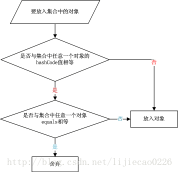

Java "==" && equals() && hashCode()详解

-----

## 概述

## 关系操作符“==”

    　“关系操作符生成的是一个boolean结果，它们计算的是操作数的值之间的关系”。

```
public class Main {

    /**
     * @param args
     */
    public static void main(String[] args) {
        // TODO Auto-generated method stub
        
        int n=3;
        int m=3;
        
        System.out.println(n==m);
        
        String str = new String("hello");
        String str1 = new String("hello");
        String str2 = new String("hello");
        
        System.out.println(str1==str2);
        
        str1 = str;
        str2 = str;
        System.out.println(str1==str2);
    }

}

输出结果为 true false true

```

* 8种基本数据类型的变量，变量直接存储的是“值”，因此在用关系操作符==来进行比较时，比较的就是 “值” 本身。

* 对于非基本数据类型的变量，或者说引用类型的变量。比如上面的str1就是引用类型的变量，引用类型的变量存储的并不是 “值”本身，而是于其关联的对象在内存中的地址。

* 对于基本类型的包装对象中的Integer
```
public class Main {
    public static void main(String[] args) {
         
        Integer i1 = 100;
        Integer i2 = 100;
        Integer i3 = 200;
        Integer i4 = 200;
         
        System.out.println(i1==i2);
        System.out.println(i3==i4);
    }
}

true
false

```
为什么会出现这样的结果？
在通过valueOf方法创建Integer对象的时候，如果数值在[-128,127]之间，便返回指向IntegerCache.cache中已经存在的对象的引用；否则创建一个新的Integer对象。
上面的代码中i1和i2的数值为100，因此会直接从cache中取已经存在的对象，所以i1和i2指向的是同一个对象，而i3和i4则是分别指向不同的对象。

Short、Byte、Character、Long类似，Double、Float则不行。

详见 [Java基础类型与包装器](../Wrapper/Wrapper.md)

## equals()

    equals方法是基类Object中的方法，因此对于所有的继承于Object的类都会有该方法。

    equals方法不能作用于基本数据类型的变量

下面是Object类中equals方法的实现：
```
    public boolean equals(Object o) {
        return this == o;
    }
```
很显然，在Object类中，equals方法是用来比较两个对象的引用是否相等，即是否指向同一个对象。

若某个类没有覆盖equals()方法，当它的通过equals()比较两个对象时，实际上是比较两个对象是不是同一个对象。这时，等价于通过“==”去比较这两个对象。

为什么下面一段代码的输出结果是true？

```
public class Main {

    /**
     * @param args
     */
    public static void main(String[] args) {
        // TODO Auto-generated method stub
        
        String str1 = new String("hello");
        String str2 = new String("hello");
        
        System.out.println(str1.equals(str2));
    }
}
```

String类中equals方法的具体实现：

```
    @Override public boolean equals(Object other) {
        if (other == this) {
          return true;
        }
        if (other instanceof String) {
            String s = (String)other;
            int count = this.count;
            if (s.count != count) {
                return false;
            }

            // 注意这里优先比较hasCode()
            if (hashCode() != s.hashCode()) {
                return false;
            }
            char[] value1 = value;
            int offset1 = offset;
            char[] value2 = s.value;
            int offset2 = s.offset;
            for (int end = offset1 + count; offset1 < end; ) {
                if (value1[offset1] != value2[offset2]) {
                    return false;
                }
                offset1++;
                offset2++;
            }
            return true;
        } else {
            return false;
        }
    }
```

可以看出，String类对equals方法进行了重写，用来比较指向的字符串对象所存储的字符串是否相等。

关于String的比较并不是这么简单,可能涉及到常量池和new操作符，详见

[String](../String/String.md)

## hashCode()

    hashCode是根类Obeject中的方法。

    hashCode() 的作用是获取哈希码，也称为散列码；

    hashCode 默认返回对象在JVM中的存储地址。

    hashCode是为了提高在散列结构存储中查找的效率，在线性表中没有作用。


hashCode()方法和equal()方法的作用其实一样，在Java里都是用来对比两个对象是否相等一致。
     
那么equal()既然已经能实现对比的功能了，为什么还要hashCode()呢？

因为重写的equal（）里一般比较的比较全面比较复杂，这样效率就比较低，而利用hashCode()进行对比，则只要生成一个hash值进行比较就可以了，效率很高，那么hashCode()既然效率这么高为什么还要equal()呢？

因为hashCode()并不是完全可靠，有时候不同的对象他们生成的hashcode也会一样（生成hash值得公式可能存在的问题），所以hashCode()只能说是大部分时候可靠，并不是绝对可靠

Object中的hashCode源码：
源码的注释写点也很清楚：
equal()相等的两个对象他们的hashCode()肯定相等；
要么两个都重写，要么两个都不重写
```
    /**
     * Returns an integer hash code for this object. By contract, any two
     * objects for which {@link #equals} returns {@code true} must return
     * the same hash code value. This means that subclasses of {@code Object}
     * usually override both methods or neither method.
     *
     * <p>Note that hash values must not change over time unless information used in equals
     * comparisons also changes.
     *
     * <p>See <a href="{@docRoot}reference/java/lang/Object.html#writing_hashCode">Writing a correct
     * {@code hashCode} method</a>
     * if you intend implementing your own {@code hashCode} method.
     *
     * @return this object's hash code.
     * @see #equals
     */
    public int hashCode() {
        int lockWord = shadow$_monitor_;
        final int lockWordMask = 0xC0000000;  // Top 2 bits.
        final int lockWordStateHash = 0x80000000;  // Top 2 bits are value 2 (kStateHash).
        if ((lockWord & lockWordMask) == lockWordStateHash) {
            return lockWord & ~lockWordMask;
        }
        return System.identityHashCode(this);
    }
```
在Object类中的默认实现是“将该对象的内部地址转换成一个整数返回”。 

String类源码中重写的hashCode方法如下：

```
    @Override public int hashCode() {
        int hash = hashCode;
        if (hash == 0) {
            if (count == 0) {
                return 0;
            }
            final int end = count + offset;
            final char[] chars = value;
            for (int i = offset; i < end; ++i) {
                hash = 31*hash + chars[i];
            }
            hashCode = hash;
        }
        return hash;
    }
```

hashCode()和equal()一样都是基本类Object里的方法，而和equal()一样，Object里hashCode()里面只是返回当前对象的地址

这样的话，那么我们相同的一个类，new两个对象，由于他们在内存里的地址不同，则他们的hashCode（）不同，这显然不是我们想要的.

所以我们必须重写我们类的hashCode()方法，即一个类，在hashCode()里面返回唯一的一个hash值

### 对象放入散列集合的流程图



从上面的图中可以清晰地看到在存储一个对象时，先进行hashCode值的比较，然后进行equals的比较。

## equals（） && hashCode（）

* equals和hashCode需要同时重写或者不重写

###  会创建“类对应的散列表”

这里所说的“会创建类对应的散列表”是说：我们会在HashSet, Hashtable, HashMap等等这些本质是散列表的数据结构中，用到该类。例如String,我们需要创建String的HashSet等。

在这种情况下，该类的“hashCode() 和 equals() ”是有关系的:

1.equal()相等的两个对象他们的hashCode()肯定相等，也就是用equal()对比是绝对可靠的。

2.hashCode()相等的两个对象他们的equal()不一定相等，也就是hashCode()不是绝对可靠的。因为在散列表中，hashCode()相等，即两个键值对的哈希值相等。然而哈希值相等，并不一定能得出键值对相等。
在这种情况下。若要判断两个对象是否相等，除了要覆盖equals()之外，也要覆盖hashCode()函数。否则，equals()无效。

3.若两个对象hashCode（）返回相同int数，则equals（Object obj）不一定返回true。

4.若两个对象hashCode（）返回不同int数，则equals（Object obj）一定返回false。

5. 若重写了equals(Object obj)方法，则有必要重写hashCode()方法。

6. 同一对象在执行期间若已经存储在集合中，则不能修改影响hashCode值的相关信息，否则会导致内存泄露问题


###　不会创建“类对应的散列表”

这里所说的“不会创建类对应的散列表”是说：我们不会在HashSet, Hashtable, HashMap等等这些本质是散列表的数据结构中，用到该类。

在这种情况下，该类的“hashCode() 和 equals() ”没有关系的！

这种情况下，equals() 用来比较该类的两个对象是否相等。而hashCode() 则根本没有任何作用，所以，不用理会hashCode()。

### 为什么同时需要equals和hasCode？

对于需要大量并且快速的对比的话如果都用equal()去做显然效率太低，所以解决方式是:
每当需要对比的时候，首先用hashCode()去对比，如果hashCode()不一样，则表示这两个对象肯定不相等（也就是不必再用equal()去再对比了）,如果hashCode()相同，此时再对比他们的equal()，如果equal()也相同，则表示这两个对象是真的相同了，这样既能大大提高了效率也保证了对比的绝对正确性！

这种大量的并且快速的对象对比一般使用的hash容器中，比如hashset,hashmap,hashtable等等，比如hashset里要求对象不能重复，则他内部必然要对添加进去的每个对象进行对比，而他的对比规则就是像上面说的那样，先hashCode()，如果hashCode()相同，再用equal()验证，如果hashCode()都不同，则肯定不同，这样对比的效率就很高了。

## 哈希码（HashCode）

    在Java中，哈希码代表对象的特征。
    哈希码的作用是确定该对象在哈希表中的索引位置。

哈希码产生的依据：哈希码并不是完全唯一的，它是一种算法，让同一个类的对象按照自己不同的特征尽量的有不同的哈希码，但不表示不同的对象哈希码完全不同。也有相同的情况，看程序员如何写哈希码的算法。

### 常用的哈希码的算法

1. Object类的hashCode.返回对象的内存地址经过处理后的结构，由于每个对象的内存地址都不一样，所以哈希码也不一样。

2.String类的hashCode.根据String类包含的字符串的内容，根据一种特殊算法返回哈希码，只要字符串所在的堆空间相同，返回的哈希码也相同。

3.Integer类，返回的哈希码就是Integer对象里所包含的那个整数的数值，例如Integer i1=new Integer(100),i1.hashCode的值就是100 。由此可见，2个一样大小的Integer对象，返回的哈希码也一样。

### 哈希冲突

    “两个不同的键值对，哈希值相等”，这就是哈希冲突

## 总结

### == 
* 如果作用于基本数据类型的变量，则直接比较其存储的 “值”是否相等；

* 如果作用于引用类型的变量，则比较的是所指向的对象的地址。

### equals

* 如果没有对equals方法进行重写，则比较的是引用类型的变量所指向的对象的地址；这时，等价于通过“==”去比较这两个对象。

* 诸如String、Date等类对equals方法进行了重写的话，则按照重写的比较规则来比较。

### hashCode

* hashCode是为了提高在散列结构存储中查找的效率，在线性表中没有作用。例如HashMap，Hashtable，HashSet；

* 将对象放入到Set中时，首先判断要放入对象的hashcode值与集合中的任意一个元素的hashcode值是否相等，如果不相等直接将该对象放入集合中。如果hashcode值相等，然后再通过equals方法判断要放入对象与Set中的任意一个对象是否相等，如果equals判断不相等，直接将该元素放入到Set中，否则不放入。

## 参考文档

[浅谈Java中的equals和==](https://www.cnblogs.com/dolphin0520/p/3592500.html)

[hashcode（）和equals（）的作用、区别、联系](https://www.cnblogs.com/keyi/p/7119825.html)

[Java hashCode() 和 equals()的若干问题解答](https://www.cnblogs.com/skywang12345/p/3324958.html)

[从一道面试题彻底搞懂hashCode与equals的作用与区别及应当注意的细节](https://blog.csdn.net/haobaworenle/article/details/53819838)

