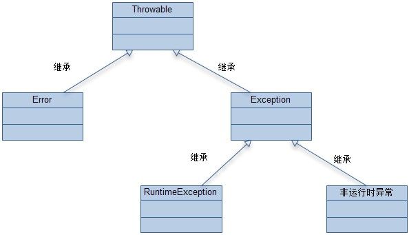
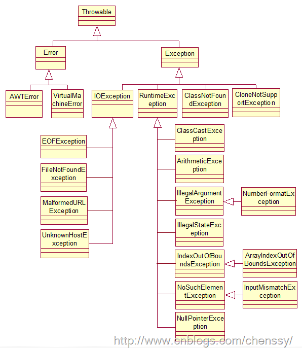

Java Exception详解

--------

## 概述

    在程序设计中，进行异常处理是非常关键和重要的一部分。一个程序的异常处理框架的好坏直接影响到整个项目的代码质量以及后期维护成本和难度。试想一下，如果一个项目从头到尾没有考虑过异常处理，当程序出错从哪里寻找出错的根源？但是如果一个项目异常处理设计地过多，又会严重影响到代码质量以及程序的性能。因此，如何高效简洁地设计异常处理是一门艺术，本文下面先讲述Java异常机制最基础的知识，然后给出在进行Java异常处理设计时的几个建议。

## 为什么要使用异常

    异常的处理机制可以确保我们程序的健壮性，提高系统可用率。

使用异常机制它能够降低错误处理代码的复杂度，如果不使用异常，那么就必须检查特定的错误，并在程序中的许多地方去处理它，而如果使用异常，那就不必在方法调用处进行检查，因为异常机制将保证能够捕获这个错误，并且，只需在一个地方处理错误，即所谓的异常处理程序中。这种方式不仅节约代码，而且把“概述在正常执行过程中做什么事”的代码和“出了问题怎么办”的代码相分离。总之，与以前的错误处理方法相比，异常机制使代码的阅读、编写和调试工作更加井井有条。（摘自《Think in java 》）。

## 什么是异常

异常的英文单词是exception，字面翻译就是“意外、例外”的意思，也就是非正常情况。

事实上，异常本质上是程序上的错误，包括程序逻辑错误和系统错误。比如使用空的引用、数组下标越界、内存溢出错误等，这些都是意外的情况，背离我们程序本身的意图。错误在我们编写程序的过程中会经常发生，包括编译期间和运行期间的错误，在编译期间出现的错误有编译器帮助我们一起修正，然而运行期间的错误便不是编译器力所能及了，并且运行期间的错误往往是难以预料的。假若程序在运行期间出现了错误，如果置之不理，程序便会终止或直接导致系统崩溃，显然这不是我们希望看到的结果。因此，如何对运行期间出现的错误进行处理和补救呢？Java提供了异常机制来进行处理，通过异常机制来处理程序运行期间出现的错误。

通过异常机制，我们可以更好地提升程序的健壮性。

## 异常体系

在Java中异常被当做对象来处理，根类是java.lang.Throwable类，在Java中定义了很多异常类（如OutOfMemoryError、NullPointerException、IndexOutOfBoundsException等），这些异常类分为两大类：Error和Exception。

- Error是无法处理的异常，比如OutOfMemoryError，一般发生这种异常，JVM会选择终止程序。因此我们编写程序时不需要关心这类异常。

- Exception，也就是我们经常见到的一些异常情况，比如NullPointerException、IndexOutOfBoundsException，这些异常是我们可以处理的异常。

- Exception类的异常包括checked exception和unchecked exception（unchecked exception也称运行时异常RuntimeException，当然这里的运行时异常并不是前面我所说的运行期间的异常，只是Java中用运行时异常这个术语来表示，Exception类的异常都是在运行期间发生的）。

- unchecked exception（非检查异常），也称运行时异常（RuntimeException），比如常见的NullPointerException、IndexOutOfBoundsException。对于运行时异常，java编译器不要求必须进行异常捕获处理或者抛出声明，由程序员自行决定。

- checked exception（检查异常），也称非运行时异常（运行时异常以外的异常就是非运行时异常），java编译器强制程序员必须进行捕获处理，比如常见的IOExeption和SQLException。对于非运行时异常如果不进行捕获或者抛出声明处理，编译都不会通过。

在Java中，异常类的结构层次图如下图所示：


在Java中，所有异常类的父类是Throwable类，Error类是error类型异常的父类，Exception类是exception类型异常的父类，RuntimeException类是所有运行时异常的父类，RuntimeException以外的并且继承Exception的类是非运行时异常。

* 典型的RuntimeException包括NullPointerException、IndexOutOfBoundsException、IllegalArgumentException等。

* 典型的非RuntimeException包括IOException、SQLException等。




##　如何处理异常

    在网上看了这样一个搞笑的话：世界上最真情的相依，是你在try我在catch。无论你发神马脾气，我都默默承受，静静处理。

在Java中如果需要处理异常，必须先对异常进行捕获，然后再对异常情况进行处理。如何对可能发生异常的代码进行异常捕获和处理呢？使用try和catch关键字即可，如下面一段代码所示：

```
public class ExceptionTest {
    public static void main(String[] args) {
        String file = "D:\\exceptionTest.txt";
        FileReader reader;
        try {
            reader = new FileReader(file);
            Scanner in = new Scanner(reader);  
            String string = in.next();  
            System.out.println(string + "不知道我有幸能够执行到不.....");
        } catch (FileNotFoundException e) {
            e.printStackTrace();
            System.out.println("对不起,你执行不到...");
        }  
        finally{
            System.out.println("finally 在执行...");
        }
    }
}

执行结果：
java.io.FileNotFoundException: D:\exceptionTest.txt (系统找不到指定的文件。)
    at java.io.FileInputStream.open(Native Method)
    at java.io.FileInputStream.<init>(FileInputStream.java:106)
    at java.io.FileInputStream.<init>(FileInputStream.java:66)
    at java.io.FileReader.<init>(FileReader.java:41)
    at com.test9.ExceptionTest.main(ExceptionTest.java:19)
对不起,你执行不到...
finally 在执行...
```

从这个结果我们可以看出这些：

      1、当程序遇到异常时会终止程序的运行（即后面的代码不在执行），控制权交由异常处理机制处理。

      2、catch捕捉异常后，执行里面的函数。

不论程序是否发生异常，finally代码块总是会执行。所以finally一般用来关闭资源。

若程序中显示的声明了某个异常，则抛出异常时不会显示出处，若程序中没有显示的声明某个异常，当抛出异常时，系统会显示异常的出处。

在Java中进行异常处理的话，对于可能会发生异常的代码，可以选择三种方法来进行异常处理：

* 对代码块用try..catch进行异常捕获处理；

* 在 该代码的方法体外用throws进行抛出声明，告知此方法的调用者这段代码可能会出现这些异常，你需要谨慎处理。此时有两种情况：

    - 如果声明抛出的异常是非运行时异常，此方法的调用者必须显示地用try..catch块进行捕获或者继续向上层抛出异常。

    - 如果声明抛出的异常是运行时异常，此方法的调用者可以选择地进行异常捕获处理。

* 在代码块用throw手动抛出一个异常对象，此时也有两种情况，跟2）中的类似：

    - 如果抛出的异常对象是非运行时异常，此方法的调用者必须显示地用try..catch块进行捕获或者继续向上层抛出异常。

    - 如果抛出的异常对象是运行时异常，此方法的调用者可以选择地进行异常捕获处理。

　　（如果最终将异常抛给main方法，则相当于交给jvm自动处理，此时jvm会简单地打印异常信息）

## 关键字

### try,catch,finally

　　try关键字用来包围可能会出现异常的逻辑代码，它单独无法使用，必须配合catch或者finally使用。Java编译器允许的组合使用形式只有以下三种形式：

```
　　try...catch...;

   try....finally......;    
   
   try....catch...finally...
```

当然catch块可以有多个，注意try块只能有一个,finally块是可选的（但是最多只能有一个finally块）。

三个块执行的顺序为try—>catch—>finally。

当然如果没有发生异常，则catch块不会执行。但是finally块无论在什么情况下都是会执行的（这点要非常注意，因此部分情况下，都会将释放资源的操作放在finally块中进行）。

在有多个catch块的时候，是按照catch块的先后顺序进行匹配的，一旦异常类型被一个catch块匹配，则不会与后面的catch块进行匹配。

### finally与return

    这里的执行顺序也是常见的面试题

在使用try..catch..finally块的时候，注意千万不要在finally块中使用return，因为finally中的return会覆盖已有的返回值。

下面看一个例子：
```
import java.io.FileInputStream;
import java.io.FileNotFoundException;
import java.io.IOException;
 
 
public class Main {
    public static void main(String[] args) {
        String str = new Main().openFile();
        System.out.println(str);
         
    }
     
    public String openFile() {
        try {
            FileInputStream inputStream = new FileInputStream("d:/a.txt");
            int ch = inputStream.read();
            System.out.println("aaa");
            return "step1";
        } catch (FileNotFoundException e) {
            System.out.println("file not found");
            return "step2";
        }catch (IOException e) {
            System.out.println("io exception");
            return "step3";
        }finally{
            System.out.println("finally block");
            //return "finally";
        }
    }
}

输出：
file not found
finally block
step2
```

可以看出，在try块中发生FileNotFoundException之后，就跳到第一个catch块，打印"file not found"信息，并将"step2"赋值给返回值，然后执行finally块，最后将返回值返回。

从这个例子说明，无论try块或者catch块中是否包含return语句，都会执行finally块。

如果将这个程序稍微修改一下，将finally块中的return语句注释去掉，运行结果是：

```
file not found
finally block
finally
```
最后打印出的是"finally"，返回值被重新覆盖了。

因此如果方法有返回值，切忌不要再finally中使用return，这样会使得程序结构变得混乱。

### throw和throws

* throws出现在方法的声明中，表示该方法可能会抛出的异常，然后交给上层调用它的方法程序处理，允许throws后面跟着多个异常类型；

* throw是语句抛出异常。它不可以单独使用，要么与try…catch配套使用，要么与throws配套使用。

* 一般会用于程序出现某种逻辑时程序员主动抛出某种特定类型的异常。throw只会出现在方法体中，当方法在执行过程中遇到异常情况时，将异常信息封装为异常对象，然后throw出去。throw关键字的一个非常重要的作用就是 异常类型的转换（会在后面阐述道）。

throws表示出现异常的一种可能性，并不一定会发生这些异常；
throw则是抛出了异常，执行throw则一定抛出了某种异常对象。
两者都是消极处理异常的方式（这里的消极并不是说这种方式不好），只是抛出或者可能抛出异常，但是不会由方法去处理异常，真正的处理异常由此方法的上层调用处理。

```
//使用throws抛出异常
    public void f() throws MyException{
         try {
            FileReader reader = new FileReader("G:\\myfile\\struts.txt");  
             Scanner in = new Scanner(reader);  
             System.out.println(in.next());
        } catch (FileNotFoundException e) {
            throw new MyException("文件没有找到", e);    //throw
        }  
        
    }
```

## 自定义异常

Java确实给我们提供了非常多的异常，但是异常体系是不可能预见所有的希望加以报告的错误，所以Java允许我们自定义异常来表现程序中可能会遇到的特定问题，总之就是一句话：我们不必拘泥于Java中已有的异常类型。

 Java自定义异常的使用要经历如下四个步骤：

1. 定义一个类继承Throwable或其子类。

2. 添加构造方法(当然也可以不用添加，使用默认构造方法)。

3. 在某个方法类抛出该异常。

4. 捕捉该异常。

```
/** 自定义异常 继承Exception类 **/
public class MyException extends Exception{
    public MyException(){
        
    }
    
    public MyException(String message){
        super(message);
    }
}

public class Test {
    public void display(int i) throws MyException{
        if(i == 0){
            throw new MyException("该值不能为0.......");
        }
        else{
            System.out.println( i / 2);
        }
    }
    
    public static void main(String[] args) {
        Test test = new Test();
        try {
            test.display(0);
            System.out.println("---------------------");
        } catch (MyException e) {
            e.printStackTrace();
        }
    }
}
```

## 异常链

    在设计模式中有一个叫做责任链模式，该模式是将多个对象链接成一条链，客户端的请求沿着这条链传递直到被接收、处理。同样Java异常机制也提供了这样一条链：异常链。

我们知道每遇到一个异常信息，我们都需要进行try…catch,一个还好，如果出现多个异常呢？分类处理肯定会比较麻烦，那就一个Exception解决所有的异常吧。这样确实是可以，但是这样处理势必会导致后面的维护难度增加。最好的办法就是将这些异常信息封装，然后捕获我们的封装类即可。

诚然在应用程序中，我们有时候不仅仅只需要封装异常，更需要传递。怎么传递？throws!！bingo，正确！！但是如果仅仅只用throws抛出异常，那么你的封装类，怎么办？？

我们有两种方式处理异常，一是throws抛出交给上级处理，二是try…catch做具体处理。但是这个与上面有什么关联呢？

    try…catch的catch块我们可以不需要做任何处理，仅仅只用throw这个关键字将我们封装异常信息主动抛出来。然后在通过关键字throws继续抛出该方法异常。它的上层也可以做这样的处理，以此类推就会产生一条由异常构成的异常链。

    通过使用异常链，我们可以提高代码的可理解性、系统的可维护性和友好性。

  同理，我们有时候在捕获一个异常后抛出另一个异常信息，并且希望将原始的异常信息也保持起来，这个时候也需要使用异常链。

在异常链的使用中，throw抛出的是一个新的异常信息，这样势必会导致原有的异常信息丢失，如何保持？在Throwable及其子类中的构造器中都可以接受一个cause参数，该参数保存了原有的异常信息，通过getCause()就可以获取该原始异常信息。


语法：
```
public void test() throws XxxException{
        try {
            //do something:可能抛出异常信息的代码块
        } catch (Exception e) {
            throw new XxxException(e);
        }
    }
```

示例

```
public class Test {
    public void f() throws MyException{
         try {
            FileReader reader = new FileReader("G:\\myfile\\struts.txt");  
             Scanner in = new Scanner(reader);  
             System.out.println(in.next());
        } catch (FileNotFoundException e) {
            //e 保存异常信息
            throw new MyException("文件没有找到--01",e);
        }  
    }
    
    public void g() throws MyException{
        try {
            f();
        } catch (MyException e) {
            //e 保存异常信息
            throw new MyException("文件没有找到--02",e);
        }
    }
    
    public static void main(String[] args) {
        Test t = new Test();
        try {
            t.g();
        } catch (MyException e) {
            e.printStackTrace();
        }
    }
}
```
运行结果
```
com.test9.MyException: 文件没有找到--02
    at com.test9.Test.g(Test.java:31)
    at com.test9.Test.main(Test.java:38)
Caused by: com.test9.MyException: 文件没有找到--01
    at com.test9.Test.f(Test.java:22)
    at com.test9.Test.g(Test.java:28)
    ... 1 more
Caused by: java.io.FileNotFoundException: G:\myfile\struts.txt (系统找不到指定的路径。)
    at java.io.FileInputStream.open(Native Method)
    at java.io.FileInputStream.<init>(FileInputStream.java:106)
    at java.io.FileInputStream.<init>(FileInputStream.java:66)
    at java.io.FileReader.<init>(FileReader.java:41)
    at com.test9.Test.f(Test.java:17)
    ... 2 more
```

如果在程序中,去掉e，也就是：throw new MyException("文件没有找到--02");

那么异常信息就保存不了，运行结果如下

```
com.test9.MyException: 文件没有找到--02
    at com.test9.Test.g(Test.java:31)
    at com.test9.Test.main(Test.java:38)
```


## 使用建议

* 只在必要使用异常的地方才使用异常，不要用异常去控制程序的流程

* 尽可能的减小try块

* 切忌使用空catch块

* catch语句应当尽量指定具体的异常类型，而不应该指定涵盖范围太广的Exception类。 不要一个Exception试图处理所有可能出现的异常

* 检查异常和非检查异常的选择

* 注意catch块的顺序

* 不要将提供给用户看的信息放在异常信息里

* 避免多次在日志信息中记录同一个异常

* 异常处理尽量放在高层进行

* 在finally中释放资源,保证所有资源都被正确释放

* 既然捕获了异常，就要对它进行适当的处理。不要捕获异常之后又把它丢弃，不予理睬。 不要做一个不负责的人。

* 在异常处理模块中提供适量的错误原因信息，组织错误信息使其易于理解和阅读。

* 不要在finally块中处理返回值。

* 不要在构造函数中抛出异常。

## 总结

异常使用指南（摘自：Think in java）应该在下列情况下使用异常:

      1、在恰当的级别处理问题（在知道该如何处理异常的情况下才捕获异常）。

      2、解决问题并且重新调用产生异常的方法。

      3、进行少许修补，然后绕过异常发生的地方继续执行。

      4、用别的数据进行计算，以代替方法预计会返回的值。

      5、把当前运行环境下能做的事情尽量做完。然后把相同（不同）的异常重新抛到更高层。

      6、终止程序。

      7、进行简化。

      8、让类库和程序更加安全。（这既是在为调试做短期投资，也是在为程序的健壮做长期投资）

## 参考文档

[Java异常处理和设计](https://www.cnblogs.com/dolphin0520/p/3769804.html)

[java提高篇(十六)-----异常（一）](https://www.cnblogs.com/chenssy/p/3438130.html)

[java提高篇(十六)-----异常（二）](https://www.cnblogs.com/chenssy/p/3453039.html)