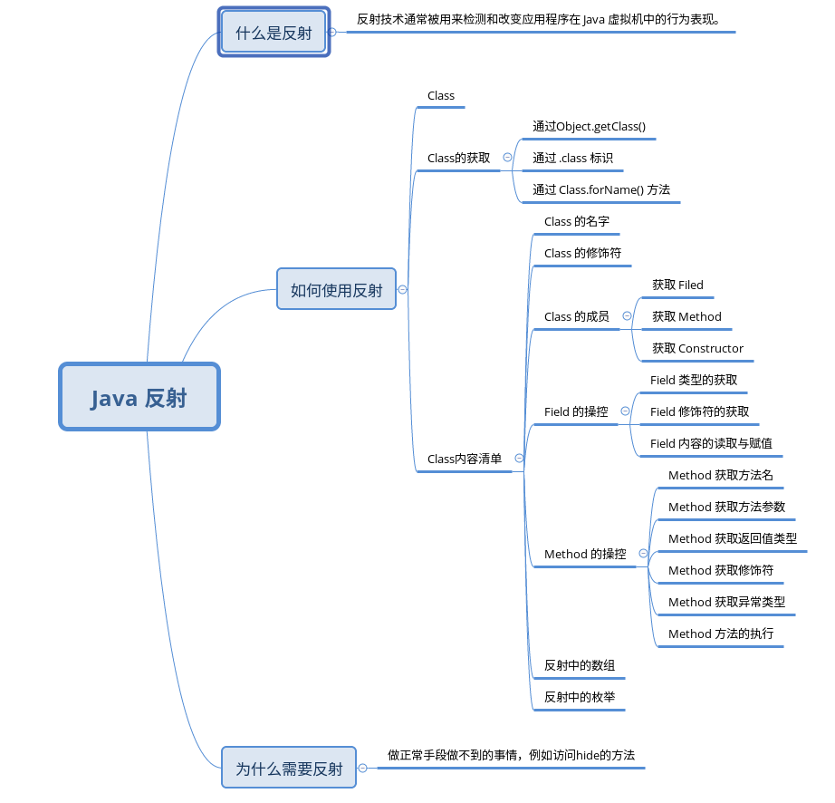

Java 反射详解

------

## 概述

什么是反射？

    Reflection is commonly used by programs which require the ability to examine or modify the runtime behavior of applications running in the Java virtual machine. This is a relatively advanced feature and should be used only by developers who have a strong grasp of the fundamentals of the language. With that caveat in mind, reflection is a powerful technique and can enable applications to perform operations which would otherwise be impossible. 

    反射技术通常被用来检测和改变应用程序在 Java 虚拟机中的行为表现。它是一个相对而言比较高级的技术，通常它应用的前提是开发者本身对于 Java 语言特性有很强的理解的基础上。值得说明的是，反射是一种强有力的技术特性，因此可以使得应用程序突破一些藩篱，执行一些常规手段无法企及的目的。 

为什么要用反射?

    为了做一般手段做不到的事情。

怎么用反射?
    
    这是我们这个主题的重点，下面会详细介绍反射的使用方法以及各种细节。

思维导图：



## 反射使用详解

### Class

    Class是首字母大写，不同于class 小写，class是定义类的关键字，而Class的本质也是一个类，因为在Java 中一切都是对象。

```
    public final class Class<T> implements java.io.Serializable,
                              GenericDeclaration,
                              Type,
                              AnnotatedElement {
                                
```
    Class 就是一个对象，它用来代表运行在 Java 虚拟机中的类和接口。 

### Class的获取

    如何拿到一个类的Class对象?

    反射的入口是 Class，但是反射中 Class 是没有公开的构造方法的，所以就没有办法像创建一个类一样通过 new 关键字来获取一个 Class 对象。

    Java 反射中 Class 的获取可以通过下面 3 种方式

#### 通过 Object.getClass()

```
public class Car {}

public class Test {

    public static void main(String[] args) {

        Car car = new Car();

        Class clazz = car.getClass();
    }

}
```
值得注意的是，这种方法不适合基本类型如 int、float 等等。

#### 通过 .class 标识

    如果不想创建这个类的实例的话，就需要通过 `.class 这个标识。

```
public class Test {

    public static void main(String[] args) {

        Class clazz = Car.class;
        Class cls1 = int.class;
        Class cls2 = String.class;

    }
}
```

#### 通过 Class.forName() 方法

    有时候，我们没有办法创建一个类的实例，甚至没有办法用 Car.class 这样的方式去获取一个类的 Class 对象。 

    在 Android 开发领域很常见，因为某种目的，Android 工程师把一些类加上了 @hide 注解，所示这些类就没有出现在 SDK 当中。
    那么，我们要获取这个并不存在于当前开发环境中的类的 Class 对象时就没有辙了吗？
    答案是否定的，Java 给我们提供了 Class.forName() 这个方法。 

    只要给这个方法中传入一个类的全限定名称就好了，那么它就会到 Java 虚拟机中去寻找这个类有没有被加载。 

```
try {
    Class clz = Class.forName("com.dhy.test.Car");
} catch (ClassNotFoundException e) {
    // TODO Auto-generated catch block
    e.printStackTrace();
}
```
    “com.dhy.test.Car” 就是 Car 这个类的全限定名称，它包括包名+类名。 
    如果找不到时，它会抛出 ClassNotFoundException 这个异常

## Class内容清单

    仅仅拿到 Class 对象还不够，我们感兴趣的是它的内容


### Class的名字

Class 对象也有名字，涉及到的 API 有：

```
Class.getName();

Class.getSimpleName();

Class.getCanonicalName();
```

因为 Class 是一个入口，它代表引用、基本数据类型甚至是数组对象，所以获取它们的方式又有一点不同。 下面详细分析说明三个方法。

#### getName

- 当Class 代表一个引用时
  
getName() 方法返回的是一个二进制形式的字符串，比如“com.dhy.test.Car”。

- 当 Class 代表一个基本数据类型，比如 int.class 的时候

getName() 方法返回的是它们的关键字，比如 int.class 的名字是 int。

- 当 Class 代表的是基础数据类型的数组时 比如 int[][][] 这样的 3 维数组时

getName() 返回 [[[I 这样的字符串。

```
public class Test {

    public static void main(String[] args) {

        try {
            Class clz = Class.forName("com.dhy.test.Car");

            Class clz1 = float.class;

            Class clz2 = Void.class;

            Class clz3 = new int[]{}.getClass();

            Class clz4 = new Car[]{}.getClass();

            System.out.println(clz.getName());
            System.out.println(clz1.getName());
            System.out.println(clz2.getName());
            System.out.println(clz3.getName());
            System.out.println(clz4.getName());


        } catch (ClassNotFoundException e) {
            // TODO Auto-generated catch block
            e.printStackTrace();
        }

    }

}
output:
com.dhy.test.Car
float
java.lang.Void
[I
[Lcom.dhy.test.Car;
```

#### getSimpleName 

    getSimpleName() 自然是要去获取 simplename 的，那么对于一个 Class 而言什么是 SimpleName呢？我们先要从嵌套类说起

```
public class Outter {

    static class Inner {}

}

Class clz = Outter.Inner.class;

System.out.println(" Inner Class name:"+clz.getName());
System.out.println(" Inner Class simple name:"+clz.getSimpleName());

Inner Class name:com.dhy.test.Outter$Inner
Inner Class simple name:Inner
```

因为是内部类，所以通过 getName() 方法获取到的是二进制形式的全限定类名，并且类名前面还有个 $ 符号。
getSimpleName() 则直接返回了 Inner，去掉了包名限定。 

- 获取一个数组的 Class 中的 simplename时

不同于 getName() 方法，simplename 不是在前面加 [，而是在后面添加对应数量的 []

```
Class clz = new Outter.Inner[][][]{}.getClass();

System.out.println(" Inner Class name:"+clz.getName());
System.out.println(" Inner Class simple name:"+clz.getSimpleName());

Inner Class name:[[[Lcom.dhy.test.Outter$Inner;
 Inner Class simple name:Inner[][][]
```

- 对于匿名内部类，getSimpleName() 返回的是一个空的字符串

```
Runnable run = new Runnable() {

    @Override
    public void run() {
        // TODO Auto-generated method stub

    }
};
System.out.println(" Inner Class name:"+run.getClass().getName());
System.out.println(" Inner Class simple name:"+run.getClass().getSimpleName());

 anonymous Class name:com.dhy.test.Test$1
 anonymous Class simple name:
```

#### getCanonicalName

    Canonical 是官方、标准的意思，那么 getCanonicalName() 自然就是返回一个 Class 对象的官方名字，这个官方名字 canonicalName 是 Java 语言规范制定的，如果 Class 对象没有 canonicalName 的话就返回 null。

    getCanonicalName() 是 getName() 和 getSimpleName() 的结合。


* getCanonicalName() 返回的也是全限定类名，但是对于内部类，不用 $ 开头，而用 .
* getCanonicalName() 对于数组类型的 Class，同 simplename 一样直接在后面添加 [] 
* getCanonicalName() 不同于 simplename 的地方是，不存在 canonicalName 的时候返回 null 而不是空字符串。
* 局部类和匿名内部类不存在 canonicalName。

```
Class clz = new Outter.Inner[][][]{}.getClass();

System.out.println(" Inner Class name:"+clz.getName());
System.out.println(" Inner Class simple name:"+clz.getSimpleName());
System.out.println(" Inner Class canonical name:"+clz.getCanonicalName());


//run 是匿名类
Runnable run = new Runnable() {

    @Override
    public void run() {
        // TODO Auto-generated method stub

    }
};

System.out.println(" anonymous Class name:"+run.getClass().getName());
System.out.println(" anonymous Class simple name:"+run.getClass().getSimpleName());
System.out.println(" anonymous Class canonical name:"+run.getClass().getCanonicalName());

// local 是局部类
class local{};


System.out.println("Local a name:"+local.class.getName());
System.out.println("Local a simplename:"+local.class.getSimpleName());
System.out.println("Local a canonicalname:"+local.class.getCanonicalName());

```

#### 源码

```
    public String getName() {
        String name = this.name;
        if (name == null)
            this.name = name = getNameNative();
        return name;
    }

    @FastNative
    private native String getNameNative();
```

```
    public String getSimpleName() {
        if (isArray())
            return getComponentType().getSimpleName()+"[]";

        if (isAnonymousClass()) {
            return "";
        }

        if (isMemberClass() || isLocalClass()) {
            return getInnerClassName();
        }

        String simpleName = getName();
        final int dot = simpleName.lastIndexOf(".");
        if (dot > 0) {
            return simpleName.substring(simpleName.lastIndexOf(".")+1); // strip the package name
        }

        return simpleName;
    }
```
```
    public String getCanonicalName() {
        if (isArray()) {
            String canonicalName = getComponentType().getCanonicalName();
            if (canonicalName != null)
                return canonicalName + "[]";
            else
                return null;
        }
        if (isLocalOrAnonymousClass())
            return null;
        Class<?> enclosingClass = getEnclosingClass();
        if (enclosingClass == null) { // top level class
            return getName();
        } else {
            String enclosingName = enclosingClass.getCanonicalName();
            if (enclosingName == null)
                return null;
            return enclosingName + "." + getSimpleName();
        }
    }
```

### Class 获取修饰符

通常，Java 开发中定义一个类，往往是要通过许多修饰符来配合使用的。它们大致分为 4 类。

* 用来限制作用域，如 public、protected、priviate。
* 用来提示子类复写，abstract。
* 用来标记为静态类 static。
* 注解。

Java 反射提供了 API 去获取这些修饰符。

Class.getModifiers()

```
package com.dhy.test;

public abstract class TestModifier {

}
```

我们定义了一个类，名字为 TestModifier，被 public 和 abstract 修饰，现在我们要提取这些修饰符。我们只需要调用 Class.getModifiers() 方法就是了，它返回的是一个 int 数值。 

```
System.out.println("modifiers value:"+TestModifier.class.getModifiers());
System.out.println("modifiers :"+Modifier.toString(TestModifier.class.getModifiers()));

modifiers value:1025
modifiers :public abstract
```

    为什么会返回一个整型数值呢？
 
 一个类定义的时候可能会被多个修饰符修饰，为了一并获取，Java 工程师考虑到了位运算，用一个 int 数值来记录所有的修饰符，然后不同的位对应不同的修饰符.
 
 这些修饰符对应的位都定义在 Modifier 这个类当中。调用 Modifier.toString() 方法就可以打印出一个类的所有修饰符。
```
 /**

    public static final int PUBLIC           = 0x00000001;

    public static final int PRIVATE          = 0x00000002;

    public static final int PROTECTED        = 0x00000004;

    public static final int STATIC           = 0x00000008;

    public static final int FINAL            = 0x00000010;

    public static final int SYNCHRONIZED     = 0x00000020;

    public static final int VOLATILE         = 0x00000040;

    public static final int TRANSIENT        = 0x00000080;

    public static final int NATIVE           = 0x00000100;

    public static final int INTERFACE        = 0x00000200;

    public static final int ABSTRACT         = 0x00000400;

    public static final int STRICT           = 0x00000800;

    public static String toString(int mod) {
        StringBuilder sb = new StringBuilder();
        int len;

        if ((mod & PUBLIC) != 0)        sb.append("public ");
        if ((mod & PROTECTED) != 0)     sb.append("protected ");
        if ((mod & PRIVATE) != 0)       sb.append("private ");

        /* Canonical order */
        if ((mod & ABSTRACT) != 0)      sb.append("abstract ");
        if ((mod & STATIC) != 0)        sb.append("static ");
        if ((mod & FINAL) != 0)         sb.append("final ");
        if ((mod & TRANSIENT) != 0)     sb.append("transient ");
        if ((mod & VOLATILE) != 0)      sb.append("volatile ");
        if ((mod & SYNCHRONIZED) != 0)  sb.append("synchronized ");
        if ((mod & NATIVE) != 0)        sb.append("native ");
        if ((mod & STRICT) != 0)        sb.append("strictfp ");
        if ((mod & INTERFACE) != 0)     sb.append("interface ");

        if ((len = sb.length()) > 0)    /* trim trailing space */
            return sb.toString().substring(0, len-1);
        return "";
    }
```
Modifier 还提供了一系列的静态工具方法用来对修饰符进行操作。

```
    public static boolean isPublic(int mod) {
        return (mod & PUBLIC) != 0;
    }

    public static boolean isPrivate(int mod) {
        return (mod & PRIVATE) != 0;
    }

    public static boolean isProtected(int mod) {
        return (mod & PROTECTED) != 0;
    }
    ...
```

源码：
```
    public int getModifiers() {
        if (isArray()) {
            int componentModifiers = getComponentType().getModifiers();
            if ((componentModifiers & Modifier.INTERFACE) != 0) {
                componentModifiers &= ~(Modifier.INTERFACE | Modifier.STATIC);
            }
            return Modifier.ABSTRACT | Modifier.FINAL | componentModifiers;
        }
        int JAVA_FLAGS_MASK = 0xffff;
        int modifiers = this.getInnerClassFlags(accessFlags & JAVA_FLAGS_MASK);
        return modifiers & JAVA_FLAGS_MASK;
    }
```

### 获取 Class 的成员

    一个类的成员包括属性（有人翻译为字段或者域）、方法。对应到 Class 中就是 Field、Method、Constructor。 

#### 获取 Filed

    获取指定名字的属性有 2 个 API
```
    //获取所有的属性，但不包括从父类继承下来的属性
    @FastNative
    public native Field getDeclaredField(String name) throws NoSuchFieldException;

    //获取自身的所有的 public 属性，包括从父类继承下来的。
    @CallerSensitive
    public Field[] getFields() throws SecurityException {
        List<Field> fields = new ArrayList<Field>();
        getPublicFieldsRecursive(fields);
        return fields.toArray(new Field[fields.size()]);
    }

```

两者的区别：

- getDeclaredField() 获取的是 Class 中被 private 修饰的属性。 
- getField() 方法获取的是非私有属性，并且 getField() 在当前 Class 获取不到时会向祖先类获取。

```
public class Farther {

    public int a;

    private int b;

}

public class Son extends Farther {
    int c;

    private String d;

    protected float e;
}


import java.lang.reflect.Field;

public class FieldTest {

    public static void main(String[] args) 
        // TODO Auto-generated method stub

        Class cls = Son.class;

        try {
            Field field = cls.getDeclaredField("b");

        } catch (NoSuchFieldException e) {
            // TODO Auto-generated catch block
            e.printStackTrace();
            System.out.println("getDeclaredField "+e.getMessage());
        } catch (SecurityException e) {
            // TODO Auto-generated catch block
            e.printStackTrace();
            System.out.println("getDeclaredField "+e.getMessage());
        }

        try {
            Field field = cls.getField("b");

        } catch (NoSuchFieldException e) {
            // TODO Auto-generated catch block
            e.printStackTrace();
            System.out.println("getField "+e.getMessage());
        } catch (SecurityException e) {
            // TODO Auto-generated catch block
            e.printStackTrace();
            System.out.println("getField "+e.getMessage());
        }


        Field[] filed1 = cls.getDeclaredFields();

        for ( Field f : filed1 ) {
            System.out.println("Declared Field :"+f.getName());
        }

        Field[] filed2 = cls.getFields();

        for ( Field f : filed2 ) {
            System.out.println("Field :"+f.getName());
        }

    }

}
```
需要注意的是 getDeclaredFileds() 方法可以获取 private、protected、public 和 default 属性，但是它获取不到从父类继承下来的属性。 

#### 获取 Method

    类或者接口中的方法对应到 Class 就是 Method。 
    相应的 API 如下：

```
public Method getDeclaredMethod(String name, Class<?>... parameterTypes)

public Method getMethod(String name, Class<?>... parameterTypes)

public Method[] getDeclaredMethods() throws SecurityException


public Method getMethod(String name, Class<?>... parameterTypes) 
```
因为跟 Field 类似，所以不做过多的讲解。parameterTypes 是方法对应的参数。

#### 获取 Constructor

    Java 反射把构造器从方法中单独拎出来了，用 Constructor 表示。

    相应的 API 如下：

```
public Constructor<T> getDeclaredConstructor(Class<?>... parameterTypes)

public Constructor<T> getConstructor(Class<?>... parameterTypes)

public Constructor<?>[] getDeclaredConstructors() throws SecurityException 

public Constructor<?>[] getConstructors() throws SecurityException 
```

因为，Constructor 不能从父类继承，所以就没有办法通过 getConstructor() 获取到父类的 Constructor。 

我们获取到了 Field、Method、Constructor,但这一是终点，相反，这正是反射机制中开始的地方，我们运用反射的目的就是为了获取和操控 Class 对象中的这些成员。

### Field 的操控

我们在一个类中定义字段时，通常是这样。

```
public class Son extends Farther {
    int c;

    private String d;

    protected float e;

    Car car;

}
```

像 c、d、e、car 这些变量都是属性，在反射机制中映射到 Class 对象中都是 Field，很显然，它们也有对应的类别。

它们要么是 8 种基础类型 int、long、float、double、boolean、char、byte 和 short。或者是引用，所有的引用都是 Object 的后代。 

#### Field 类型的获取

获取 Field 的类型，通过 2 个方法：
```
public Type getGenericType() {}

public Class<?> getType() {}
```
两者返回的类型不一样，getGenericType() 方法能够获取到泛型类型。

#### Field 修饰符的获取

    同 Class 一样，Field 也有很多修饰符。通过 getModifiers() 方法就可以轻松获取。

```
public int getModifiers() {}
```
    这个与前面 Class 获取修饰符一致,不再赘述

#### Field 内容的读取与赋值
    这个应该是反射机制中对于 Field 最主要的目的了。

Field 这个类定义了一系列的 get/set方法来获取/设置不同类型的值。

```
    @FastNative
    public native Object get(Object obj)
        throws IllegalArgumentException, IllegalAccessException;

    @FastNative
    public native void set(Object obj, Object value)
        throws IllegalArgumentException, IllegalAccessException;
```
方法中出现的 Object 参数，它其实是类的实例引用

Class 本身不对成员进行储存，它只提供检索，所以需要用 Field、Method、Constructor 对象来承载这些成员，所以，针对成员的操作时，一般需要为成员指定类的实例引用。如果难于理解的话，可以这样理解，班级这个概念是一个类，一个班级有几十名学生，现在有A、B、C 3 个班级，将所有班级的学生抽出来集合到一个场地来考试，但是学生在试卷上写上自己名字的时候，还要指定自己的班级，这里涉及到的 Object 其实就是类似的作用，表示这个成员是具体属于哪个 Object。这个是为了精确定位。

```
A testa = new A();
testa.a = 10;

System.out.println("testa.a = "+testa.a);

Class c = A.class;

try {
    Field fielda = c.getField("a");

    int ra = fielda.getInt(testa);

    System.out.println("reflection testa.a = "+ra);

    fielda.setInt(testa, 15);

    System.out.println("testa.a = "+testa.a);

} catch (NoSuchFieldException e) {
    // TODO Auto-generated catch block
    e.printStackTrace();
} catch (SecurityException e) {
    // TODO Auto-generated catch block
    e.printStackTrace();
} catch (IllegalArgumentException e) {
    // TODO Auto-generated catch block
    e.printStackTrace();
} catch (IllegalAccessException e) {
    // TODO Auto-generated catch block
    e.printStackTrace();
}

testa.a = 10
reflection testa.a = 10
testa.a = 15
```

##### Field 被 private 修饰的情况

    在反射中访问了 private 修饰的成员，如果要消除异常的话，需要添加一句代码。

```
fieldb.setAccessible(true);
```

### Method 的操控
    Method 对应普通类的方法。 
    我们看看一般普通类的方法的构成。

```
public int add(int a,int b);
```

方法由下面几个要素构成：
- 方法名
- 方法参数
- 方法返回值
- 方法的修饰符
- 方法可能会抛出的异常

很显然，反射中 Method 提供了相应的 API 来提取这些元素。

#### Method 获取方法名
    通过 getName() 这个方法就好了。

```
public class MethodTest {

    public static void main(String[] args) {
        // TODO Auto-generated method stub
        Car car = new Car();

        Class clz = car.getClass();

        Method methods[] = clz.getDeclaredMethods();

        for ( Method m : methods ) {
            System.out.println("method name:"+m.getName());
        } 
    }

}

method name:toString
method name:drive
```
#### Method 获取方法参数

```
public Parameter[] getParameters() {}
```

返回的是一个 Parameter 数组，在反射中Parameter对象就是用来映射方法中的参数。经常使用的方法有：

```
// 获取参数名字
public String getName() {}

// 获取参数类型
public Class<?> getType() {}

// 获取参数的修饰符
public int getModifiers() {}
```

当然，有时候我们不需要参数的名字，只要参数的类型就好了，通过 Method 中下面的方法获取。 

```
// 获取所有的参数类型
public Class<?>[] getParameterTypes() {}

// 获取所有的参数类型，包括泛型
public Type[] getGenericParameterTypes() {}
```

#### Method 获取返回值类型

```
// 获取返回值类型
public Class<?> getReturnType() {}


// 获取返回值类型包括泛型
public Type getGenericReturnType() {}
```

#### Method 获取修饰符

```
public int getModifiers() {}
```

#### Method 获取异常类型

```
public Class<?>[] getExceptionTypes() {}

public Type[] getGenericExceptionTypes() {}
```

### Method 方法的执行

    这个应该是整个反射机制的核心内容了，很多时候运用反射目的其实就是为了以常规手段执行 Method。通过调用invoke方法

```
public Object invoke(Object obj, Object... args) {}
```

Method 调用 invoke() 的时候，存在许多细节：

    invoke() 方法中第一个参数 Object 实质上是 Method 所依附的 Class 对应的类的实例，如果这个方法是一个静态方法，那么 ojb 为 null，后面的可变参数 Object 对应的自然就是参数。

    invoke() 返回的对象是 Object，所以实际上执行的时候要进行强制转换。

    在对 Method 调用 invoke() 的时候，如果方法本身会抛出异常，那么这个异常就会经过包装，由 Method 统一抛出 InvocationTargetException。而通过 InvocationTargetException.getCause() 可以获取真正的异常。

### Constructor 的操控

在平常开发的时候，构造器也称构造方法，但是在反射机制中却把它与 Method 分离开来，单独用 Constructor 这个类表示。

Constructor 同 Method 差不多，但是它特别的地方在于，它能够创建一个对象。

在 Java 反射机制中有两种方法可以用来创建类的对象实例：Class.newInstance() 和 Constructor.newInstance()。官方文档建议开发者使用后面这种方法，下面是原因。

    Class.newInstance() 只能调用无参的构造方法，而 Constructor.newInstance() 则可以调用任意的构造方法。
    Class.newInstance() 通过构造方法直接抛出异常，而 Constructor.newInstance() 会把抛出来的异常包装到 InvocationTargetException 里面去，这个和 Method 行为一致。
    Class.newInstance() 要求构造方法能够被访问，而 Constructor.newInstance() 却能够访问 private 修饰的构造器。

我们学习了 Class 对象的获取，也能够获取它内部成员 Filed、Method 和 Constructor 并且能够操作它们。在这个基础上，我们已经能够应付普通的反射开发了。

### 反射中的数组

    数组本质上是一个 Class，而在 Class 中存在一个方法用来识别它是否为一个数组。

```
public native boolean isArray();
``` 

#### 反射中动态创建数组

    反射创建数组是通过 Array.newInstance() 这个方法。 

```
public static Object newInstance(Class<?> componentType, int... dimensions)
        throws IllegalArgumentException, NegativeArraySizeException {}
```

```
// 创建一个 int[2][3] 的数组
Array.newInstance(int.class,2,3);
```

#### Array 的读取与赋值
    首先，对于 Array 整体的读取与赋值，把它作为一个普通的 Field，根据 Class 中相应获取和设置就好了。调用的是 Field 中对应的方法。

    还需要处理的情况是对于数组中指定位置的元素进行读取与赋值，这要涉及到 Array 提供的一系列 setXXX() 和 getXXX() 方法。因为和之前 Field 相应的 set 、get 方法类似，大家很容易知晓其它类型的怎么操作。
### 反射中的枚举 Enum

    同数组一样，枚举本质上也是一个 Class 而已，但反射中还是把它单独提出来了。

    在 Java 反射中，可以把枚举看成一般的 Class，但是反射机制也提供了 3 个特别的的 API 用于操控枚举。 

```
// 用来判定 Class 对象是不是枚举类型
Class.isEnum()

// 获取所有的枚举常量
Class.getEnumConstants()


// 判断一个 Field 是不是枚举常量
java.lang.reflect.Field.isEnumConstant()
```

#### 枚举的获取与设定

因为等同于 Class，所以枚举的获取与设定就可以通过 Field 中的 get() 和 set() 方法。

需要注意的是，如果要获取枚举里面的 Field、Method、Constructor 可以调用 Class 的通用 API。

```
public enum State {
    IDLE,
    DRIVING,
    STOPPING,

    test();

    int test1() {
        return 0;
    }

}

public class Meiju {

    private State state = State.DRIVING;

    public State getState() {
        return state;
    }

    public void setState(State state) {
        this.state = state;
    }
}

public static void main(String[] args) {

        Class clz = State.class;

        if ( clz.isEnum()){
            System.out.println(clz.getName()+" is Enum");

            System.out.println(Arrays.asList(clz.getEnumConstants()));
            // 获取枚举中所有的 Field
            Field[] fs = clz.getDeclaredFields();

            for ( Field f : fs ) {
                if ( f.isEnumConstant()){
                    System.out.println(f.getName()+" is EnumConstant");
                }else {
                    System.out.println(f.getName()+" is not EnumConstant");
                }
            }

            Class cMeiju = Meiju.class;
            Meiju meiju = new Meiju();

            try {
                Field f = cMeiju.getDeclaredField("state");
                f.setAccessible(true);


                try {
                    State state = (State) f.get(meiju);

                    System.out.println("State current is "+state);

                    f.set(meiju, State.STOPPING);


                    System.out.println("State current is "+meiju.getState());

                } catch (IllegalArgumentException e) {
                    // TODO Auto-generated catch block
                    e.printStackTrace();
                } catch (IllegalAccessException e) {
                    // TODO Auto-generated catch block
                    e.printStackTrace();
                }

            } catch (NoSuchFieldException e) {
                // TODO Auto-generated catch block
                e.printStackTrace();
            } catch (SecurityException e) {
                // TODO Auto-generated catch block
                e.printStackTrace();
            }
        }

    }

}
com.dhy.test.State is Enum
[IDLE, DRIVING, STOPPING, test]
IDLE is EnumConstant
DRIVING is EnumConstant
STOPPING is EnumConstant
test is EnumConstant
ENUM$VALUES is not EnumConstant
State current is DRIVING
State current is STOPPING

```


## 实例

详见 [JavaReflectionDemo](https://github.com/sunnycoder/JavaReflection)_

## 常见问题

TODO


## 总结

    Java 中的反射是非常规编码方式。
    Java 反射机制的操作入口是获取 Class 文件。 有 Class.forName()、 .class 和 Object.getClass() 3 种。
    获取 Class 对象后还不够，需要获取它的 Members，包含 Field、Method、Constructor。
    Field 操作主要涉及到类别的获取，及数值的读取与赋值。
    Method 算是反射机制最核心的内容，通常的反射都是为了调用某个 Method 的 invoke() 方法。
    通过 Class.newInstance() 和 Constructor.newInstance() 都可以创建类的对象实例，但推荐后者。因为它适应于任何构造方法，而前者只会调用可见的无参数的构造方法。
    数组和枚举可以被看成普通的 Class 对待。

反射是非常规开发手段，它会抛弃 Java 虚拟机的很多优化，所以同样功能的代码，反射要比正常方式要慢，所以考虑到采用反射时，要考虑它的时间成本。另外，就如无人驾驶之于汽车一样，用着很爽的同时，其实风险未知。

## 参考文档

* [细说反射，Java 和 Android 开发者必须跨越的坎](https://blog.csdn.net/briblue/article/details/74616922)

* [反射进阶，编写反射代码值得注意的诸多细节](https://blog.csdn.net/briblue/article/details/76223206)