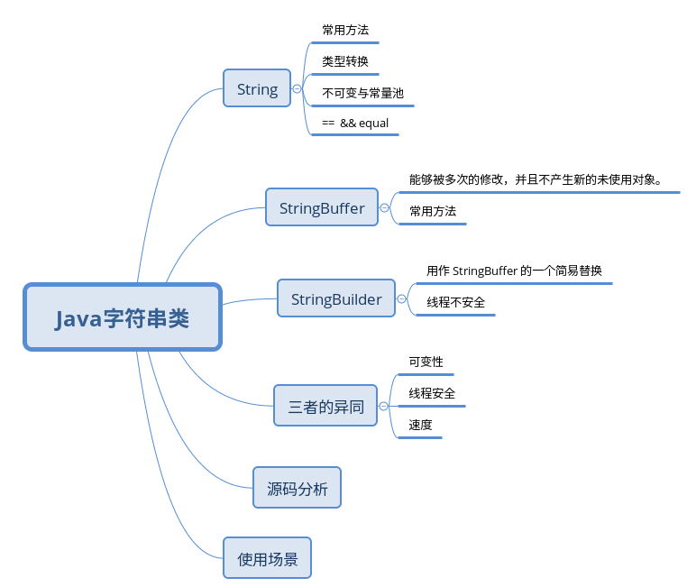
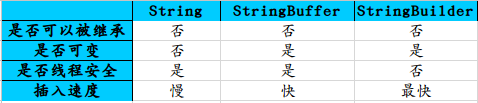

String StringBuffer StringBuilder详解

-----------

## 概述

java中String、StringBuffer、StringBuilder是编程中经常使用的字符串类,他们之间的区别也是经常在面试中会问到的问题。

下面详细分析下这三个字符串类，并做对比总结。




## String

    String类是final修饰的，不能被继承，String类对象创建后不能修改，由0或多个字符组成，包含在一对双引号之间。


### 常用方法

1. 构造方法，String有11个构造方法，支持传入不同类型的参数

2. length() :  返回字该字符串的长度

3. charAt(int indext) : 求字符串某一位置的字符，index必须>=0并且<= length()-1

4. 截取字符串
    
    * substring(int beginIndex) : 该方法从beginIndex位置起（包含这个位置）到最后截取一个字符串返回。[beginIndex,最后]

    * substring(int beginIndex，endIndex) : 该方法从beginIndex位置起（包含这个位置）到endIndex - 1截取一个字符串返回。[beginIndex,endIndex - 1]

```
String str1 = new String("abcdefgkl");
String str2 = str1.substring(2);//str2 = "cdefgkl"
String str3 = str1.substring(2,5);//str3 = "cde"
```

5. 字符串比较

    * public int compareTo(String anotherString)
    
        该方法是对字符串内容按字典顺序进行大小比较，通过返回的整数值指明当前字符串与参数字符串的大小关系。若当前对象比参数大则返回正整数，反之返回负整数，相等返回0。其比较规则是：拿出字符串的第一个字符与参数的第一个字符进行比较，如果两者不等，比较结束，返回两者的ascii差。这里有一点需要注意：如果两个字符串的长度不同，并且一个字符串与另一个字符串的前面N个字符相等，那么这个方法返回返回两个字符串长度之差。

    * public int compareToIgnore(String anotherString)

        与compareTo方法相似，但忽略大小写。

    * public boolean equals(Object anotherObject)

        比较当前字符串和参数字符串，在两个字符串相等的时候返回true，否则返回false。

    * public boolean equalsIgnoreCase(String anotherString)

        与equals方法相似，但忽略大小写。


```
    String s1 = "abcd";
    String s2 = "abce";
    String s3 = "ABC";
    String s4 = "abcdefg";
    String s5 = "abc";
    System.out.println(s1.compareTo(s2));
    System.out.println(s1.compareTo(s3));
    System.out.println(s4.compareTo(s1)); 
    System.out.println(s4.compareTo(s2)); 
    System.out.println(s3.compareToIgnoreCase(s5)); 
    System.out.println(s3.equals(s5)); 
    System.out.println(s3.equalsIgnoreCase(s5));

output:

-1
32
3
-1
0
false
true
```

6. 字符串连接

   * public String concat(String str)

        将参数中的字符串str连接到当前字符串的后面，效果等价于"+"。 

7. 字符串中单个字符查找

    * public int indexOf(int ch/String str)
    
        用于查找当前字符串中字符或子串，返回字符或子串在当前字符串中从左边起首次出现的位置，若没有出现则返回-1。

    * public int indexOf(int ch/String str, int fromIndex)
    
        与第一种类似，区别在于该方法从fromIndex位置向后查找。

    * public int lastIndexOf(int ch/String str)

        方法与第一种类似，区别在于该方法从字符串的末尾位置向前查找。

    * public int lastIndexOf(int ch/String str, int fromIndex)

        该方法与第二种方法类似，区别于该方法从fromIndex位置向前查找。

```
    String str = "I am a good student";
    System.out.println(str.indexOf('a'));
    System.out.println(str.indexOf("good"));
    System.out.println(str.indexOf("w",2));
    System.out.println(str.lastIndexOf("a"));
    System.out.println(str.lastIndexOf("a",3));

output:
2
7
-1
5
2

```

8. 字符串中字符的大小写转换

    * public String toLowerCase()
    
        返回将当前字符串中所有字符转换成小写后的新串
    * public String toUpperCase()
    
        返回将当前字符串中所有字符转换成大写后的新串

9. 字符串中字符的替换

    * public String replace(char oldChar, char newChar)

        用字符newChar替换当前字符串中所有的oldChar字符，并返回一个新的字符串。

    * public String replaceFirst(String regex, String replacement)

        该方法用字符replacement的内容替换当前字符串中遇到的第一个和字符串regex相匹配的子串，应将新的字符串返回。

    * public String replaceAll(String regex, String replacement)

        该方法用字符replacement的内容替换当前字符串中遇到的所有和字符串regex相匹配的子串，应将新的字符串返回。

    注意replaceAll的参数是regex,即基于规则表达式的替换,

10. 其他方法

    * String trim()

        截去字符串两端的空格，但对于中间的空格不处理。如果要去掉所有空格可以利用replaceAll(" ","");

    * contains(String str)

        判断参数s是否被包含在字符串中，并返回一个布尔类型的值。

    * String[] split(String str)

        将str作为分隔符进行字符串分解，分解后的字符串在字符串数组中返回。

### 字符串与基本类型的转换

1. 字符串转换为基本类型

```
1)public static byte parseByte(String s)
2)public static short parseShort(String s)
3)public static short parseInt(String s)
4)public static long parseLong(String s)
5)public static float parseFloat(String s)
6)public static double parseDouble(String s)
```

2. 基本类型转换为字符串类型

 String类中提供了String valueOf()放法，用作基本类型转换为字符串类型。
```
1)static String valueOf(char data[])
2)static String valueOf(char data[], int offset, int count)
3)static String valueOf(boolean b)
4)static String valueOf(char c)
5)static String valueOf(int i)
6)static String valueOf(long l)
7)static String valueOf(float f)
8)static String valueOf(double d)

```

### String常量池

    常量池(constant pool)指的是在编译期被确定，并被保存在已编译的.class文件中的一些数据。它包括了关于类、方法、接口等中的常量，也包括字符串常量。

Java为了提高性能，静态字符串（字面量/常量/常量连接的结果）在常量池中创建，并尽量使用同一个对象，重用静态字符串。对于重复出现的字符串直接量，JVM会首先在常量池中查找，如果常量池中存在即返回该对象。

```

    public class test1 {
        public static void main(String[] args) {
            String str1 = "Hello"; // 常量池未有该对象，需要创建，生成两个对象
            String str2 = "Hello"; //生成了1个对象"Hello" 
            // 不会创建新的String对象，而是使用常量池中已有的"Hello"
            System.out.println(str1 == str2); // true

            // 使用new关键字会创建新的String对象，不管常量池里面有没有相同的值 
            String str3 = new String("Hello");// 生成了2个对象"Hello"和new String("Hello") 
            System.out.println(str1 == str3); // false
        }
    }
```

### ==  && equal

    equal和"=="两者均表示相等的意思，但是他们相等的含义却有所区别。

    “==”运用在基本数据类型的时候，通过比较它们实际的值来判定是否相同；而用于比较引用类型的时候，则是**比较两个引用的地址**是否相等，也就是是否指向同一个对象。

    equal方法是java.lang.Object的方法，也就是所以的Java类都会有的方法。它可以被程序员覆盖重写，通过自定义的方式来判定两个对象是否相等。
    
    对于字符串java.lang.String类来说，它的equal方法用来比较字符串的字符序列是否完全相等。

```
public class EqualTest
{
    public static void main(String args[])
    {
        //定义三个字符串变量
        String a="1234";
        String b="1234";
        String c=new String("1234"); 
        //三种不同的布尔判断
        System.out.println(a==b);
        System.out.println(a==c);
        System.out.println(a.equal(c));
    }
    
}

    true
    false
    true
```

### String对象不可变

String是常量，其对象一旦构造就不能再被改变。换句话说，String对象是不可变的，每一个看起来会修改String值的方法，实际上都是创造了一个全新的String对象，以包含修改后的字符串内容。而最初的String对象则丝毫未动。

### Ascii码

    常用字母Ascii码 ： a z A Z

## StringBuffer

和 String 类不同的是，StringBuffer类的对象能够被多次的修改，并且不产生新的未使用对象。 

### 常用方法

* public StringBuffer append(String s)
    
    将指定的字符串追加到此字符序列。
    
* public StringBuffer reverse()
    
    将此字符序列用其反转形式取代。

* public delete(int start, int end)
    
    移除此序列的子字符串中的字符。
    
* public insert(int offset, int i)
    
    将 int 参数的字符串表示形式插入此序列中。

* replace(int start, int end, String str)
    
    使用给定 String 中的字符替换此序列的子字符串中的字符。

* int capacity()
    
    返回当前容量

* void setCharAt(int index, char ch)
    
    将给定索引处的字符设置为 ch。

* void setLength(int newLength)
    
    设置字符序列的长度。


## StringBuilder

StringBuilder是5.0新增的。此类提供一个与 StringBuffer 兼容的 API，但不保证同步。该类被设计用作 StringBuffer 的一个简易替换，用在字符串缓冲区被单个线程使用的时候（这种情况很普遍）。

由于 StringBuilder 相较于 StringBuffer 有速度优势，所以多数情况下建议使用 StringBuilder 类。然而在应用程序要求线程安全的情况下，则必须使用 StringBuffer 类。 

两者的方法基本相同。

## String、StringBuffer和StringBuilder的异同

0. 都是 final 类, 都不允许被继承

1. 是否可变

    * String: 不可变
    * StringBuilder：可变
    * StringBuffer：可变

String创建的对象位于常量池，是一个不可变常量,注意String类并不是字符串常量，而是创建的对象是字符串常量。
对于String对象，当常量池中不存在，则在常量池中创建，再复制到堆中。
StringBuilder/StringBuffer位于堆中，引用在java虚拟机栈的局部变量表中

2. 线程是否安全

    * String: 线程安全
    * StringBuilder：非线程安全的
    * StringBuffer： 线程安全

    String中的对象是不可变的，也就可以理解为常量，所以线程安全。

    StringBuilder没有对方法进行加同步锁，所以是非线程安全的。

    StringBuffer中的方法大都采用了synchronized关键字修饰，所以是线程安全的

3. 字符串追加速度比较

    StringBuilder > StringBuffer > String

StringBuffer与StringBuilder，他们是字符串变量，是可改变的对象，每当我们用它们对字符串做操作时，实际上是在一个对象上操作的，不像String一样创建一些对象进行操作，所以速度就快了。

## 注意事项

1) 基本原则：如果要操作少量的数据，用String ；单线程操作大量数据，用StringBuilder ；多线程操作大量数据，用StringBuffer。

2) 不要使用String类的”+”来进行频繁的拼接，因为那样的性能极差的，应该使用StringBuffer或StringBuilder类，这在Java的优化上是一条比较重要的原则。

3) StringBuilder一般使用在方法内部来完成类似”+”功能，因为是线程不安全的，所以用完以后可以丢弃。StringBuffer主要用在全局变量中。

4) 相同情况下使用 StirngBuilder 相比使用 StringBuffer 仅能获得 10%~15% 左右的性能提升，但却要冒多线程不安全的风险。而在现实的模块化编程中，负责某一模块的程序员不一定能清晰地判断该模块是否会放入多线程的环境中运行，因此：除非确定系统的瓶颈是在 StringBuffer 上，并且确定你的模块不会运行在多线程模式下，才可以采用StringBuilder；否则还是用StringBuffer。

## 面试考点

1. String对象创建的内存模型

    * 创建的对象
    * 对象比较 equal && ==

2. String、StringBuffer和StringBuilder的异同

## 使用场景

1.如果要操作少量的数据用 String
2.单线程操作字符串缓冲区 下操作大量数据  StringBuilder
3.多线程操作字符串缓冲区 下操作大量数据  StringBuffer 

## 源码分析

TODO

[String、StringBuffer、StringBuilder源码解读](https://www.cnblogs.com/snifferhu/p/5903958.html)

## 总结




## 参考文档

[String&&StringBuffer&&StringBuilder深层次解析](https://blog.csdn.net/fullstackdeveloper/article/details/52029135)

[String、StringBuffer、StringBuilder详解](https://www.jianshu.com/p/5d5ea61256b6)