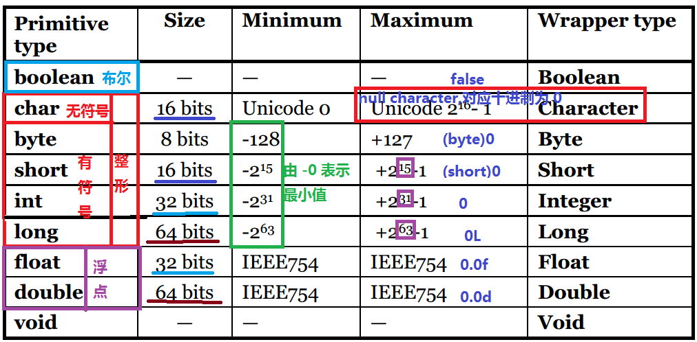
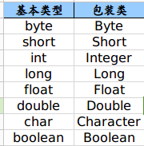

Java基础类型与包装器详解

-------

## 概述

详细分析下Java中基础类型和其包装类型

思维导图：


## 基础类型
    在Java中有八种基本数据类型



### 自动转型与强制转型

#### 自动转型

自动转型总原则：byte,short,char(同级)-> int -> long -> float -> double (由低精度到高精度)

1. 由低精度到高精度的自动转换

    * 从位数低的类型向位数高的类型转换

```
    byte b = 1;
    char c = 1;
    short s = 1;
    int i = 1;

    c = b;  // Error，同级
    c = s;  // Error，同级
    s = c;  // Error，同级
    i = c;  // OK
```

   * 从整型向浮点型的转换

```
    int i = 1；
    long t = 1;
    float f = 1;
    double d = 1;

    f = i;  //  Ok
    f = t;  //  Ok
    d = f;  // Ok
```

2. 运算符对基本类型的影响 

   * 当使用 +、-、*、/、%、==、>、< 等 等运算符对基本类型进行运算时，遵循如下规则:
   
   两个操作数中，先考虑是否有一个是double类型的。如果有，另一个操作数和结果 将会被转换成double类型。再依次考虑float,long。除此之外，两个操作数（包括byte、short、int、char）都将会被转换成int类型。

```
byte b1 = 10 ;  //OK，会检查发现10没有超过byte类型的最大值
byte b2 = 12;   //OK，会检查发现12没有超过byte类型的最大值

byte b = b1 + b2; //Error，byte类型在计算时会自动提升为int类型，此时就会报错，因为b1+b2实际上是int类型，但是左侧的变量为byte类型。

short s1=1; //OK，会检查发现1没有超过short类型的最大值
s1=s1+1;    //Error，因为s1+1 结果int，但左侧变量为 short，报错

s1++;      //OK，不会报错，与s1=s1+1不同！！！，会检查发现2没有超过short类型的最大值

s1=1+1;   //OK，1+1 是个编译时可以确定的常量，'+'运算在编译时就被执行了，而不是在程序执行的时候，这个语句的效果等同于s1=2
```

* 当使用 +=、-=、*=、/=、%= 、 i++、 ++i 运算符对基本类型进行运算时，遵循如下规则：

　运算符右边的数值将首先被强制转换成与运算符左边数值相同的类型，然后再执行运算，且运算结果与运算符左边数值类型相同。自增(减)运算也类似。

```
short s1=1; // OK，会检查发现1没有超过short类型的最大值
short s2;

s1+=1;    // OK，正确，1首先被强制转换为short型，然后再参与运算，并且结果也是short类型

s2 = ++s1;     // OK，正确，s2的值为2
```

#### 强制转型

强制转换的格式是在需要转型的数据前加上 “( )”， 然后在括号内加入需要转化的数据类型。

* 由高精度向低精度转换

* 一种类型到另一种类型转换，则必须使用强制类型转化（同级之间：byte,short,char）
```
 byte b = 3;
 int i = 3;
 long t = 3;
 float f = 3;
 char c = 3;
 short s = 3;

 i = (int) f;  // OK，由高精度向低精度转换
 t = (long) f;  // OK，由高精度向低精度转换
 b = (byte) i;  // OK，由高精度向低精度转换

 i = b; // OK，由低精度向高精度转换，自动转型
 System.out.println(c==s);  // OK，true，c 和 s 自动转型为int,然后比较

 b = (byte) s;  // OK，一种类型到另一种类型转换
 c = (char) b;  // OK，一种类型到另一种类型转换
 c = (char) s;   // OK，一种类型到另一种类型转换
```

　　特别需要注意的是，强制转换常常会导致二进制位的截取，甚至会导致意想不到的结果：
```
 int i = 128;
 byte b = (byte)i;
 System.out.println(b);           // -128(即-0)
```

### 注意事项

* 未带有字符后缀标识的整数默认为 int 类型，未带有字符后缀标识的浮点数默认为 double 类型；

* 只有 byte,char,short,int 四种基本类型及其包装类（需要Java5.0/1.5以上版本支持）可以用于 switch 语句（只有 enum 类型 和 int类型可以应用到 swith），其它类型编译会报错；

* char（两个字节）可以用单引号表示单个字符（可以是汉字），如：‘良’，’A’;

* 整数可以由二进制(以0B/0b开头)、八进制（以0开头的整数）、十进制、十六进制（以0x或0X开头的整数）表示;


## 包装器

Java是一个面相对象的编程语言，基本类型并不具有对象的性质，为了让基本类型也具有对象的特征，就出现了包装类型。
所有的基本类型都有一个与之对应的类，通常的情况下称这些类为包装器。

它相当于将基本类型“包装起来”，使得它具有了对象的性质，并且为其添加了属性和方法，丰富了基本类型的操作。

这些对象包装器类的名字对应于基本类型的名字，分别是Integer,Long,Double,Short,Byte,Character,Void和Boolean（前面6个类派生于公共的超类Number），对象包装器类是不可变的，即一旦构造了包装器，既不允许更改包装在其中的值，同时，对象包装器类还是final类，不允许定义他们的子类。

我们在使用集合类型Collection时就一定要使用包装类型而非基本类型，因为容器都是装object的。

基本数据类型对应的包装器类型对应如下：



### 常用方法

所有包装类都是不可变的。 它们提供了两种方法来创建它们的对象：

    使用构造函数
    使用valueOf()工厂方法

除了Character之外，每个包装类都提供至少两个构造函数：一个采用对应基本类型的值，另一个采用String类型值。

Character类只提供一个接受char的构造函数。

## 基本类型与包装器的关系

1.声明方式不同，基本类型不适用new关键字，而包装类型需要使用new关键字来在堆中分配存储空间；
 
2.存储方式及位置不同，基本类型是直接将变量值存储在堆栈中，而包装类型是将对象放在堆中，然后通过引用来使用；
 
3.初始值不同，基本类型的初始值如int为0，boolean为false，而包装类型的初始值为null
 
4.使用方式不同，基本类型直接赋值直接使用就好，而包装类型在集合如Collection、Map时会使用到。

5. 两者可以相互转换

## 自动装箱&&拆箱

    在从Java SE5开始就提供了自动装箱和拆箱的特性

### 装箱

    装箱自动将基本数据类型转换为对应包装器对象。

装箱（boxing），是从Java SE 5.0开始出现的新特性。

没有装箱，如果要生成一个数值为10的Integer对象，可以这么做：
```
nteger a=new Integer(10); 
```
有了装箱，就可以简化为这样：
```
Integer a=10;//即Integer a=Integer.valueOf(10);
```

通过反编译class文件后，我们知道装箱实际上是通过valueOf()方法实现的，该方法返回一个Integer对象。

### 拆箱
    自动将包装器对象转换为对应的基本数据类型。

拆箱（unboxed），与装箱是正好相反的操作。

```
Integer i=new Integer(5);
int b=i;//自动将Integer类对象变成int类数据类型，再赋给int类变量b
```

如果没有拆箱，就变为下面的代码

```
Integer i=new Integer(5);
int b=i.intValue(); //intValue方法以int的形式返回Integer对象的值
```

通过反编译，我们知道拆箱是通过xxxValue()方法实现的，该方法返回一个xxx类型的值。 

### 什么时候装箱，什么时候拆箱?

主要取决于：在当前场景下，你需要的是引用类型还是原生类型。

若需要引用类型，但传进来的值是原生类型，则自动装箱（例如，使用equals方法时传进来原生类型的值）；
若需要的是原生类型，但传进来的值是引用类型，则自动拆箱（例如，使用运算符进行运算时，操作数是包装类型）。

## 包装器与比较运算

==与equals()方法我们在[Java比较运算](../Equals/Equals.md)中已经做了详细的分析，这里我们看一下在比较包装器类型的对象时的特殊性

我们知道，“==“操作符用于比较它左右的操作对象是否相同。　　

　　1.当==符号比较基本数据类型时，比较的是它们的值。

　　2.当==符号计较对象时，比较的是它们的是否指向同一个区域（即是否有相同的引用）。

　　3.当==操作符的两边，一个操作数是基本数据类型，另一个是其包装对象时，则会将对象进行拆箱，从而变成两个基本数据类型进行值的比较。

### 实例分析

例1
```
Integer a = new Integer(100);  
Integer b = 100;  
System.out.println(a == b); //false
```
使用new关键字会创建新的Integer对象

例2.

```
Integer a = 100;  
Integer b = 100;  
System.out.println(a == b); //true
```

例3. 

```
Integer a = 156;  
Integer b = 156;  
System.out.println(a == b); //false
```

例4.
```
Integer a = Integer.valueOf(100);  
Integer b = 100;  
System.out.println(a == b); //true
```

为什么会是这样子的结果呢？我们先从例4开始分析。

之前说过，装箱实际上是因为编译器调用了valueOf()方法。所以例4实际就是以下代码:

```
Integer a = Integer.valueOf(100);  
Integer b = Integer.valueOf(100); 
System.out.println(a == b);
```

看一下Integer类中，valueOf()的具体实现:

```
    public static Integer valueOf(int i) {
        if (i >= IntegerCache.low && i <= IntegerCache.high)
            return IntegerCache.cache[i + (-IntegerCache.low)];
        return new Integer(i);
    }
```

其中IntegerCache类的实现为：
```
    private static class IntegerCache {
        static final int low = -128;
        static final int high;
        static final Integer cache[];

        static {
            // high value may be configured by property
            int h = 127;
            String integerCacheHighPropValue =
                sun.misc.VM.getSavedProperty("java.lang.Integer.IntegerCache.high");
            if (integerCacheHighPropValue != null) {
                try {
                    int i = parseInt(integerCacheHighPropValue);
                    i = Math.max(i, 127);
                    // Maximum array size is Integer.MAX_VALUE
                    h = Math.min(i, Integer.MAX_VALUE - (-low) -1);
                } catch( NumberFormatException nfe) {
                    // If the property cannot be parsed into an int, ignore it.
                }
            }
            high = h;

            cache = new Integer[(high - low) + 1];
            int j = low;
            for(int k = 0; k < cache.length; k++)
                cache[k] = new Integer(j++);

            // range [-128, 127] must be interned (JLS7 5.1.7)
            assert IntegerCache.high >= 127;
        }

        private IntegerCache() {}
    }
```

通过查看IntegerCache类的具体实现，我们发现low就是-128，而high就是127。
所以valueOf()方法就很明确了，当参数i为在区间[-128,127]上的int数值时，就返回缓存中的Integer对象（也就是说，从-128到127这258个数已经一次性被初始化好了，而不是创建新的）；i不在这个区间内，就返回一个新创建的Integer对象。

所以在例4中，两次调用valueOf(100)，返回的是同一个对象，这个对象是已经存在的。a和b指向同一个对象，所以a==b为true。

在例3中，装箱调用valueOf(),但参数为156，不在-128和127之间，所以新建了两个Integer对象，a和b指向不同对象，所以输出为false。

但要注意，Integer、Short、Byte、Character、Long这几个类的valueOf方法的实现是类似的。

Double、Float的valueOf方法的实现是类似的。

Double类中，valueOf()的原代码如下
```
public static Double valueOf(double d) {
        return new Double(d);
    }

```
所以下面代码的输出为两个false也不难理解。
```
Double a = 100.0;
Double b = 100.0;
Double c = 200.0;
Double d = 200.0;
System.out.println(a==b);
System.out.println(c==d);
```

再来看一个比较复杂例子：
```
Integer a = 1;
Integer b = 2;
Integer c = 3;
Integer d = 3;
Integer e = 200;
Integer f = 200;
Long g = 3L;
Long h = 2L;
         
System.out.println(c==d);
System.out.println(e==f);
System.out.println(c==(a+b));
System.out.println(c.equals(a+b));
System.out.println(g==(a+b));
System.out.println(g.equals(a+b));
System.out.println(g.equals(a+h));
答案分别为 true false true true true true false true。
```
前两个不需要解释了，前面的例子里已经有了。

第三个输出中，a+b会进行拆箱（你无法将相加两个基本类型对象），先两个int型数值然后再相加，因此==号右边变成了一个int型的数值。而前面的"3)"提到过，这里还会进行一次拆箱，将c也拆箱成int值，从而变成int值的比较，所以为true。

第四个输出中，因为有加号，所以和前面一样，a和b分别拆箱，然后相加，得到int型结果3。但和前面不同是的，equals()的参数是对象，所以3又自动装箱成了包装器对象。前面说过，包装器对象之间的比较最好用equals()方法，这样就会避免不必要的错误。

第五个输出中，因为是数值的比较，虽然一个是long型的3，一个是int型的3，但它们还是相同的。

最后两个也是大同小异，注意，int数值+long数值，根据基本数据类型的隐式转换原则，得到的结果是long型数值，最后会装箱成Long类对象。包装器对象用equals()方法进行比较，先比较对象的类相同是否相同，若不同，则为false；若属于同一类，且包装在其中的值相同，则为true。所以最后一个输出为true，倒数第二个输出为false。

### 注意事项

* 由于装箱器引用可能为null，所以自动装箱有可能会抛出一个NullPointException异常。

* 如果在一个条件表达式中混合使用Integer和Double类型，Integer值就会拆箱，提升为double，再装箱为Double。

* 装箱和拆箱是编译器认可的，而不是虚拟机。编译器再生成字节码时，插入必要的方法调用，虚拟机只是执行这些字节码。

* 避免出错和造成不必要的混乱，在比较两个包装器对象时，尽量不要使用==，而是使用equals()方法。

## 常见面试题

* 比较Boolean
```
public class Main {
    public static void main(String[] args) {
         
        Boolean i1 = false;
        Boolean i2 = false;
        Boolean i3 = true;
        Boolean i4 = true;
         
        System.out.println(i1==i2);
        System.out.println(i3==i4);
    }
}

true
true

```
看了Boolean类的源码也会一目了然。下面是Boolean的valueOf方法的具体实现：
```
    public static Boolean valueOf(boolean b) {
        return (b ? TRUE : FALSE);
    }
```
其中的 TRUE 和FALSE是在Boolean中定义了2个静态成员属性
```
    public static final Boolean TRUE = new Boolean(true);

    public static final Boolean FALSE = new Boolean(false);
```

* Integer i = new Integer(xxx)和Integer i =xxx;这两种方式的区别

　1）第一种方式不会触发自动装箱的过程；而第二种方式会触发；

　2）在执行效率和资源占用上的区别。第二种方式的执行效率和资源占用在一般性情况下要优于第一种情况（注意这并不是绝对的）。

## 总结

* 使用“==”运算符在基本类型和其包装类对象之间比较时，只要两个操作数中有一个是 基本类型 或 表达式（即包含算术运算符），就是比较它们的数值是否相等。否则，就是判断这两个对象的内存地址是否相等，即是否是同一个对象。

* 如果一个 方法中参数类型为原生数据类型 ，所传入的参数类型为其封装类对象，则会自动对其进行 拆箱；相应地，如果一个方法中 参数类型为封装类型对象 ，所传入的参数类型为其原始数据类型，则会自动对其进行 装箱 ，例如上述的equals方法。


## 参考文档

[Java 原生类型与包装器类型深度剖析](https://blog.csdn.net/justloveyou_/article/details/52651211)

[Java包装器与装箱，拆箱](https://www.cnblogs.com/EdwardChu/p/5876516.html)

[Java中基本数据类型和包装器类型的关系](https://www.cnblogs.com/huajiezh/p/5225637.html)

[https://www.cnblogs.com/dolphin0520/p/3780005.html](https://www.cnblogs.com/dolphin0520/p/3780005.html)